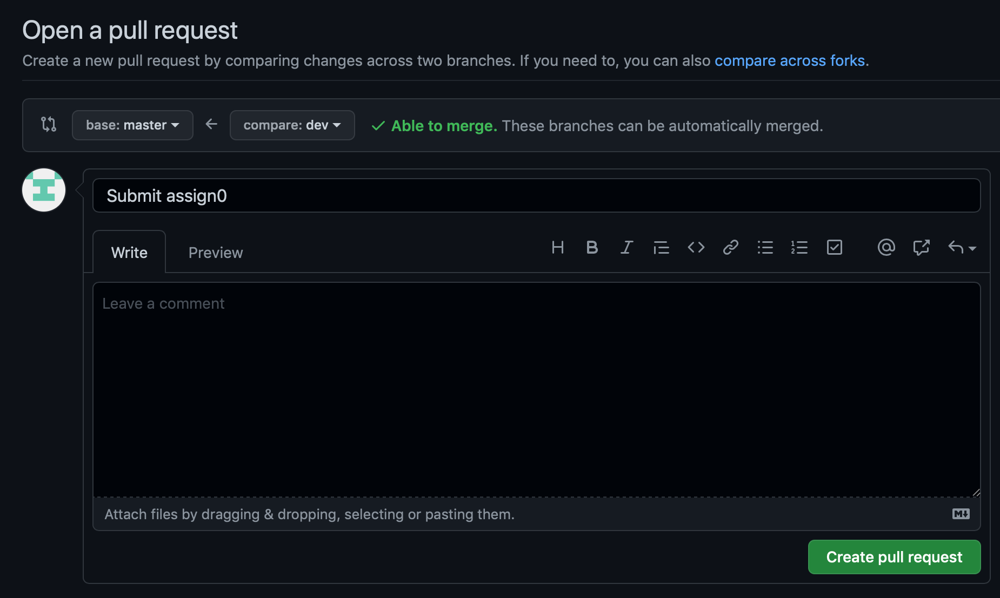


Task list to copy/paste when creating PR for this assign:

**Before releasing assign0:**

- [ ] Review writeup/starter files/process (TA)
- [ ] Followup on issues from previous quarter postmortem (issue #385)

**To prep for assign0:**

- [ ]



_Written by Omar Rizwan, updated by Maria Paula Hernandez for Spring 2022_



<small>This assignment is not for a grade, but it's critical that you understand all the topics covered and that you complete it on-time so that you are ready to tackle the upcoming assignments. If you run into troubles, please reach out on Ed or come by office hours!</small>

## Goals

Your goal for this assignment is two-fold:

1. Walk through and understand the assignment workflow
2. Practice with your tools and refresh on background concepts


The tasks you will do include downloading the starter files, editing the files, committing your changes, and submitting for grading.

This is the same workflow you will use for each assignment in the course. Our process uses the
[git](<https://en.wikipedia.org/wiki/Git_(software)>) version control
system and the [GitHub](https://github.com) repository hosting service. Note
that this assignment assumes that you've completed [lab0](/labs/lab0) in its
entirety. If you haven't done so, please go back and ensure that you've
completed all of the steps.

## Steps

### 0. Ensure you are familiar with your editing environment

In Lab 0, we asked you to explore text editors like vim and emacs. Before you 
begin the assingment, make sure that you are familiar with the editor that you chose 
to work with. This can be in the form of watching a couple of tutorials, reading 
manuals, going to Matt's special intro OH and practicing using your editor of choice! 

### 1. Switch to the dev branch and pull starter code

Navigate to your local assignments repo and check which branch you're on:

```console
$ cd ~/cs107e_home/assignments
$ git branch
```

If you're on `dev`, you're all set. Otherwise, switch to `dev`:

```console
$ git checkout dev
```
To get the starter files, verify that you're on the `dev` branch and execute the
following commands:

```console
$ git pull --allow-unrelated-histories starter-code assign0-starter 
$ ls
```
(Repeat this step even if you already did it in lab to get updated starter files). 
The `git pull` command will open up `vim` and display the message "Merge branch
'assign0-starter' of github.com:cs107e/assignments-mirror into dev". Confirm
this merge by typing `:x`, which will save and exit `vim`.

### 2. Answer background questions

Having downloaded your starter files, you should find a folder labelled 'assign0' in your assignments
repo. The folder corresponding to each assignment will contain all of the starter code that you need
to complete it. 
In the file 'background.txt', please answer the following questions. 
Please ensure that your responses are clearly labeled (i.e. 
we know what question it corresponds to) and reasonably organized.

> **Tip** If you're stuck on any of the questions, take a look at the guides section
> of the course website, post on Ed, or start reading some articles online!
> {: .callout-info}

1. What is the result of performing a bitwise OR of the following two
   hexadecimal numbers (include the result in decimal): `0x0f OR 0xff`. Now left
   shift that number by 24; what is the result in hexadecimal? Assume numbers are 32-bit.

2. How many milliamperes of current will flow through a 1.5K resistor connected
   to 3V on one end and 0V (Ground) on the other end?

3. Find a file in the directory `/etc` on your computer; tell us the name of the
   file and the number of bytes contained in that file. How many files and
   directories are contained in the first level of directory `/etc`? Include
   the commands you used to answer these questions.

4. Change directory to your `cs107e.github.io` repo and find the folder named `cs107e`. What is the
   the absolute path to this folder? What is the relative path using the
   CS107E environment variable you created during your environment setup? Remember
   this folder location! Inside the `cs107e` there is an `include` folder where all your
   assignment header files are located. (You can find more information on the filesystem in our [unix guide](/guides/unix/)).

5. What editor do you plan on using? What is your plan on learning
   how to best use your editor? (i.e. for people using vim, you can run the `vimtutor` command from your terminal). Tell us a bit about how you customized your
   editor!

6. In git speak, what is a "commit"? What is a "branch"?
   If you're unsure, refer to our [git guide](/guides/git).

### 3. Commit your change locally and push it to remote

Now you are going to tell Git about the changes you have made. The commands below add the changed file to the staging index, commit staged changes (save to local repo), and push the commit to GitHub (update remote repo):

```console
$ git status
$ git add background.txt
$ git commit -m "Answered background questions in background.txt"
$ git push
```

You can use `git log` to view the history of commits in your local repo. When
you enter the log, you can exit out by pressing "q" on your keyboard.

```console
$ git log
```

Also note that you can add multiple files (also called staging) and commit their
changes as a single commit. This is important because you don't ever want your code
to be in an inconsistent or bad state. For example, if you add a new file that
another file references, you want to put those two changes together in a single
commit; the file shouldn't be there if it isn't referenced, and you don't want
code to reference a file that doesn't exist.

Each commit that you make records a snapshot of your work. You can use these
snapshots to review your progress, compare versions, or identify and undo an
unfortunate change. Establishing good commit practices gives you the ability to
navigate the history of code changes, as well as providing the opportunity to
revert to previous versions. Sometimes you may find that you want to revert to
a commit before a set a changes that introduced a bug in your code. The more you
commit, the more opportunities you will have to restore previous working states
without losing as much work. **We recommend that you commit early and often and
that you write detailed commit messages.**

> Git command responses can sometimes look cryptic and scary. DON'T BE SCARED!!!
> Git is your friend :). Reading all the responses from git messages will help
> you understand the commands your running, and prevent you from missing
> important messages about the state of your repo.
> {: .callout-info}

**Note:** GitHub will show commits for `Branch: master` by default. To see the code and
changes for a specific assignment branch, switch to the branch by selecting it from `Branch` drop-down menu :


<a name="submit"></a>
### 4. Tag submission commit
In future assignments, we'll run tests on your submission to verify that it works as
expected. You identify which commit that we test by using a tag. We'll
also use this tag to determine your submission time. Note that the submission time recorded
will correspond to the time you pushed the tag commit, not the time the tag was 
pushed. In Git, a tag is simply a way of giving a name to a particular commit. 
Create a tag to identify this assignment's submission by doing the following:

```console
$ git tag assign0-submission
$ git push --tags
```

Be sure you always name your submission flag with the format `assignX-submission`
where X is the particular assignment number. Now, go to your repo on GitHub and
verify that your newly created tag shows up in the "Tags" section of the branches
dropdown menu.

If you commit additional changes after creating the tag, you can
move the tag to a later commit with the following command (note that you need to push `--force` when moving a tag that already exists).

```console
$ git tag -f assign0-submission
$ git push --tags --force
```
After the assignment deadline, you may resubmit your code in order to correct 
your bugs. In order to do so, please tag the updated commit 
that you would like us to grade with the format `assignX-submission-updated`.
This will be the only tag we grade for assignments past their deadline.
You may do this as multiple times as you make further changes. Note that 
every time you make additional changes after creating the tag you must move the tag 
to the commit that you want graded as outlined above. Each time we run your code, 
we will check if the tag has been updated and if so, run your submission through the 
grader and communicate the updated grade to you.

### 5. Create a pull request (submission)

In this course, assignment submission is done using GitHub's _pull request_
feature. Pull requests provide a summary view of changes made to the code as
well as a section for comments where course instructors will be providing
feedback.

The pull request model is used by many modern software projects to promote good
practices when working in a distributed development environment. The typical
flow starts with a base branch (often called _master_) that reflects the master
copy of the code. Feature development or bug fixing occurs by creating a new
_branch_ where changes are made. Once you're confident that the code in your
branch is polished, tested, and working well, you can ask other people to merge
the commits in your branch into _master_ by making a _pull request_. You've
pushed commits to your branch, you're now asking other people to pull those
commits into master. Team members use the pull request to review the
proposed changes and provide comments. When a team member approves the pull request,
GitHub automatically merges the commits back into the base branch.


You will only have to make a pull request once. After you confirm you have done 
it in this assignment, it will remain open throughout the quarter and allow us to 
grade your assignments. If you accidentally close the pull request, just make 
sure to open a new one following the steps below. 

View the contents of your remote repository on the web at `https://github.com/cs107e/[YOUR-GITHUB-USERNAME]-assignments`.
Switch to the branch `dev` by selecting it from the "Branch" drop-down
menu.

Click the 'Compare & Pull Request' button.


If the 'Compare & Pull Request' button isn't available, click 'Contribute', then 
'Open Pull Request'. 

Now you will see text entry boxes for describing the pull request, followed by
a list of the commits that you have made and a line-by-line comparison (`diff`)
of the changed files.

Set the Title to "Submission Pull Request" and leave the description blan. 


Click 'Create pull request', which will submit the pull request and take you to
a page to view it:


The pull request page will update to reflect any changes that are pushed after
the initial submission. This page will also be used by graders to provide feedback
on your submissions.

If you need to update your submission simply edit your files, commit, retag, and push to add
it to the pull request. There is no need to make another pull request. Rember to only 
retag with assignX-submission if you are resubmitting before the deadline to avoid 
getting marked as late. Past the deadline, please use the convention assignX-submission-update. 

## Afterward: test results and grader's code review

The overview comments from the grader's code review are shown the pull request page and the any inline annotations
on your code can be viewed under the `Files changed` tab.

To evaluate functionality, we run automated tests against your code.  The test results will be added to your (yet uncreated) `logs/assignX` directory. The logs will contain the test output when
run with your implementation and the expected output from the staff solution. If we observe test failures, we will file a github issue to alert you to the problem.  Your follow-up to those issues is to investigate further to find the underlying bug and fix it. Your goal is to resolve all high priority issues . This workflow replicates the process you'd follow if you were a
software engineer in industry. You'll almost never write code and forget about
it! The iterative process of writing code, and fixing bugs is as fundamental to
software engineering as mitochondria are to a living cell!
