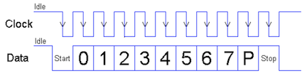


Task list to copy/paste when creating PR for this assign:

__Before releasing assign7:__
- [ ] Review writeup/starter code (instructor)
- [ ] Review consistency/completeness of grading info published to students relative to grading tests used, consider changes clarity/ease of grading (TA)
- [ ] Followup on issues from previous quarter postmortem (issue #341)

__To prep for assign7:__
- [ ] 



{: width="50%" style="float:right;"}

*Written by Philip Levis, updated by Julie Zelenski*



---
## Goals

With all your hard work on the previous assignments, your Raspberry Pi
can now read input from a keyboard and respond to your commands by drawing to a
graphical console display. For the _pièce de résistance_ you'll upgrade
your keyboard driver so that you can type as fast as the wind without
dropping characters.

Conceptually, this is about concurrency and preemption. Concurrency
is when a program is able to do more than one thing at once. Preemption
is when one task in a program can take control of the processor from
another. Both concurrency and preemption are fundamental ideas to computer systems:
they're what let web servers handle tens of thousands of clients and
your GPU to draw beautiful graphics. In this assignment, you start
from the ground up, handling the root of preemption in every computer
system: interrupts.

In completing this assignment you will have:

- redesigned your PS/2 driver to use GPIO interrupts so it doesn't drop scancodes, and
- used an interrupt-safe data structure to correctly share data across regular and interrupt code.

The stretch goal is to achieve the __complete system bonus__ which attests that you have:

+ bundled the collection of modules you've written into a comprehensive library for implementing a bare-metal system on the Pi
+ constructed a successful and complete system of your own top to bottom: your console running on your library

This work completes the transformation of your Raspberry Pi into a
standalone computer, ready to be extended and improved in your final
project. Way to go!

## Get starter files

To ensure that your courseware files are up to date, do a pull in the `cs107e.github.io` repo. 

```console
$ cd ~/cs107e_home/cs107e.github.io
$ git pull
```

Change to your local assignments repo, switch to the `dev` branch, and update your repo with the starter code by pulling from the remote repo:

```console
$ cd ~/cs107e_home/assignments
$ git checkout dev
$ git pull --allow-unrelated-histories starter-code assign7-starter
```

The final setup step is to change the symbolic link to point `Makefile` to the `assign7/makefile`.
 
```console
$ cd ~/cs107e_home/assignments
$ ln -sf makefiles/assign7.makefile Makefile
```
The source files added to your repo for assignment 7 are:

- `src/tests/test_interrupts.c`
  + test program with your unit tests
- `src/apps/interrupts_console_shell.c`
  + application program that runs your shell, reading input from the PS/2 keyboard via interrupts and displaying output to the console. You will use this program unchanged.
- `template/Makefile` and `template/main.c`
  + the `template` subdirectory contains a sample program and Makefile that layers on your own `libmypi.a` library. Make a copy of this subdirectory to create a new test program.
- `src/lib/mouse.c` 
  + module for a PS/2 mouse (only implemented if doing paint extension)

There are no new library modules for the core requirements of assignment 7; the only library module you will modify is the `ps2` module you wrote in assignment 5.

>__Take note of the assignment 7 Makefile!__ Unlike previous
 makefiles that used your code only for the modules specific to the
 current assignment, the `assign7.makefile`
 assumes that you are going for the complete system bonus and that you want to use
 your own code for __everything__. The  
 default setting for `MY_MODULES` names all of your modules.
If you need to instead use our reference implementation for a module, edit the
assign7.makefile to remove it from `MY_MODULES`. After resolving the issue, you can add the module back into `MY_MODULES` to build your complete system.
{: .callout-warning}


## Overview

The core task for this assignment is to rework your PS/2 device
driver to be interrupt-driven instead of polling.

Your keyboard driver calls `ps2_read` to get a scancode. As implemented for assignment 5, `ps2_read` sits in a loop calling `gpio_read` on the clock GPIO until it sees the level transition from high to low. If your code isn't reading the GPIO at the moment the edge falls, it misses the event. Furthermore, the CPU spins just waiting for this event and can't do anything else while it does. The polling implementation both loses events and is extremely inefficient.

Read over the code in the function `test_read_delay` in the starter file `test_interrupts.c`
and try it out with your existing keyboard driver. You should see that your code
drops any keys typed while the test program is paused inside `timer_delay`.
This is the expected behavior from the polling implementation.

Interrupts solve this problem. Instead of running a spin loop waiting for a falling
edge, your code can configure the hardware to issue an interrupt when it
sees a falling edge. The interrupt handler jumps in to immediately read the data when it is available, never missing a bit.

### 1) Configuring PS/2 interrupts

An interrupt is configured with a handler action to process a specific type of event.  For PS/2, the desired event is the falling edge on the clock GPIO, and the handler process it by reading from the data GPIO.

Edit `ps2_new` to configure the clock GPIO to  detect falling edge events (see header [gpio_extra.h](/header#gpio_extra)). Write a function to process the event by reading from the data GPIO. The handler will need to know which PS/2 device received the event; we recommend that you use the handler's `aux_data` pointer to pass the `ps2_device_t *`. For now, your handler can simply announce the interrupt with a quick `uart_putchar('+')` (don't try to print anything fancier;  there is no time!). Be sure that the handler also clears the event or it will endlessly re-trigger.

Now you need to hook up your event handler to the `gpio_interrupts` module which acts as the dispatcher for all GPIO interrupts. In `ps2_new`, initialize gpio_interrupts, register your handler, and enable it. (see header [gpio_interrupts.h](/header#gpio_interrupts))

The final steps are to initialize the top-level `interrupts` module and flip the global enable switch. (see header [interrupts.h](/header#interrupts)) These steps should be done in `main`.

Note how you configure GPIO interrupts within the PS/2 module and configure the top-level interrupts in the main program: this structure of where enables what reflects the structure of the level at which they interact with the interrupts system. 

There sure are a lot of steps to configuring an interrupt; your work from [lab7](/labs/lab7) may be helpful to review if you're missing a step or have them out of order.

Use the function `check_interrupts_received` to confirm that your handler is correctly configured and enabled. When you type a key, the handler should output a `+` for each bit in the scancode. How many `+`s correspond to one key press?

Remember, interrupt code needs to be simple and fast. 
You want it to be fast because you don't want to delay/miss the
processing of the next interrupt. You want to be simple because debugging
interrupts is so hard. Calling a complex `printf` in your handler, for example, will
cause you to miss clock edges: printing a single character takes almost 100 microseconds,
which is the same length as clock pulse in PS/2.


### 2) Gather a PS/2 scancode
The falling edge of PS/2 clock edge indicates that now is the time to grab a bit from the PS/2 data line.



When the interrupt handler is invoked, it should read one bit from the data line, and gather those bits into a scancode. The handler execute 11 times, once for each bit. Because each call to the interrupt handler has its own stack frame, you won't be able to use a stack variable to store the accumulated scancode: instead add fields to the `ps2_device_t` struct.

Your previous implementation of the `ps2_read` function formed the 8 data bits into a scancode along with logic to verify start, parity and stop bits. Adapt that code to work within your interrupt handler as it reads one bit at a time. If the handler detects an error or timeout, discard any partial scancode and re-synchronize on start bit as you did in your previous implementation.

Once your interrupt handler can gather a scancode, you're ready to enqueue those scancodes for mainline code to retrieve!

> __Tip__ Our reference version of the `ps2` module supports reading in either polling mode or by interrupts. Our ps2 device defaults to polling and can be changed into interrupt mode via an internal switch. Your ps2 module does __not__ need to support this. Just directly re-purpose your previous code to now read via interrupts without trying to preserve the old way of doing things)
{: .callout-info}

### 3) Use ring buffer
Your interrupt handler receives events and gathers a scancode. The last step is to safely pass that scancode from the interrupt handler to the code running in supervisor mode (from main). You'll do this with the ring buffer queue mentioned in lecture.  (see [ringbuffer.h](/header#ringbuffer))

Create a new ring buffer queue in `ps2_new` and add it to the `ps_device_t` struct. Once your handler function has gathered a complete scancode, add the scancode to the queue. Edit `ps2_read` to dequeue from the queue. The `ps2_read` function blocks (spins) until there is a scancode available in the queue, then dequeues and returns it. `ps2_read` always returns a scancode, either a saved scancode that was previously queued or waits for the next scancode to arrive.

You should now be able to run your same console shell application as
in assignment 6, and all should work as before, except this time you
never miss a key. The interrupt handler immediately enqueues each typed key 
for later processing by the console when ready.

You now have a fully operational console that uses the full power of your
hardware! What you have running is not too far from an Apple II computer.

### 4) Need for speed? (just for fun)

Your new interrupt-driven keyboard driver won't drop a key unless someone can
type 86+ characters in between calls to `ps2_read`: the ring buffer is 256 elements and most keys are 3 scancodes. Unless you're doing something really CPU-intensive, this is unlikely.

However a moderately fast typist can still enqueue a decent number of keys during a slow console redraw that makes for a longish wait as the console works through the backlog. __This is the expected behavior: the console receives every character that is typed and painstakingly draws and responds to that input__. But, ... if you caught the optimization fever from [performance exploration in lab7](/labs/lab7/speed), we'd love to see what you can do to improve the
refresh performance. A few ideas to consider:

- Inner loops are the first place to look for speed-up opportunities 
    (e.g. hoisting out redundant work, streamlining operations, loop unrolling). With a million pixels on the line, cutting just 10 instructions per pixel totals to a full second of time saved.
- _Cacheing_ is a technique used widely in computer science. The basic gist is that you save a result to re-use rather than having to repeatedly recompute/refetch.
  + As one example: each use of `gl_draw_char` calls `font_get_glyph` to re-extract 
    the glyph from the font bitmap. If the `gl` module extracted the glyph on first use and saved it, using the cached version on subsequent draw operations avoids the repeated work.
- Vertical scroll is particularly painful because of the need to redraw the 
    entire screen. Rather than redraw all the characters, you could copy the previously drawn pixels upward. Or ... how about a framebuffer variant that simply adjusts the `y_offset` to get scrolling for "free" and defers paying the cost of a full redraw until hit virtual bottom?
- If you do the profiler extension, you can use it to identify the hot spots in your code, which points you to the places to focus your attention to get the most impact for your efforts!

## Complete system bonus
The assign7.makefile has a `lib` target, the command `make lib` creates the build result `build/libmypi.a`. This `libmypi.a` packages together your battle-tested code of library modules into a complete library to support a bare-metal system on the Pi. We will test the interrupt-driven graphical console shell application on your library and if all works correctly, you earn the full system bonus!

To be considered for the system bonus, `libmypi.a` must use your own code for all modules (no use of reference modules). We will not re-test your individual modules to the extent that they were tested when grading each assignment, but all functionality used by shell/console must work correctly. This means, for example, your `printf` must handle printing padded hexadecimal numbers (which are needed for `peek`), but need not necessarily handle negative values perfectly (since they are not used by the shell).

The full system bonus is a big reward for a big accomplishment! You have successfully built a complete computer system from the ground up, writing your own code at every step of the way. Congratulations!

The `libmypi.a` library is in a form ready to be easily incorporated into any future project. The subdirectory `template` contains a template project that demonstrates how to build an application using your `libmypi.a`. To start a new project, make a copy of the template project and copy in your `libmypi.a`. file  Use `make run` in that project directory to build and run. You can now program your Pi almost like an Arduino with this high-level library you wrote.

## Extensions

We have two proposed extensions. Choose one OR the other (you do not need to do
both). 

### 1) Profiler

One extension is to add a `profile` command to your shell.
A _profiler_ is a developer tool that tracks where in the code a program is
spending its execution time.

If diagnosing how to improve in a slow program, your first task would be to
observe the program and measure where it spends most of its time. Speeding up
those sections of the code will have the greatest effect on the overall run
time.

There is a simple and clever way to find a program's hot spots using a _sampling_ strategy. Repeatedly interrupt the program and record a sample of where the `pc` is currently executing. The probability of observing a given value of `pc` is proportional to the time spent executing that instruction. The more often that an instruction is executed, the higher the likelihood it will be observed when sampling. After gathering enough samples, those instructions that rise to the top because of their high counts are the program's hot spots.

You can construct a sampling profiler using what you know about linking, memory, and interrupts.

Use our provided `armtimer` module and configure a countdown timer for an interval of ~500 microseconds. Set the timer event to generate interrupts and write a handler for it. (Refer to header file [armtimer.h](/header#armtimer) and sample code from the Interrupts lecture). Recall that the first argument to the interrupt handler is the `pc` of the instruction that was about to execute at the time of the interruption, so you have your sample right there! 

The profiler maintains an array of counters, one for each instruction address in the text (code) section. There is a known address where the text section starts (what value is that again?), but to know the extent of the text, you will need to edit the linker map to mark the end. It may help to revisit [lab4](/labs/lab4/) for information on linker maps.

Open the `memmap` file and, patterning after how symbols are used to mark the bounds of the bss section, add a symbol to identify the location of end of the text section. If you know where the text section starts and where it ends, you can compute the correct amount of space needed to have a counter for each instruction in the text section. The profile will scan the counters to find the entries with the highest counts to identify the hot spots.

Add the command `profile [on | off]` to your shell commands to control the profiler. `profile on` should initialize (zero-out) all profile counts and start profiling. `profile off` should stop profiling and print a list of the 20 instructions with the highest counts. These high-count instructions are the program's hot spots.

The final touch for your profiler is to provide the function name that each high-count instruction belongs to. If you remember the `name_of` function you wrote for assignment 4, the compiler has embedded each function's name as a string of characters before its first instruction. You can find the function's name by walking backwards in memory from the instruction to find the "magic" byte that marks where name is stored.

For each high-count instruction, report the count of samples recorded for that instruction, the name of the function it belongs to, and the instruction offset within the function. The profiler results look something like this:

```
  Counts  |  Function    [pc]
-----------------------------
    2331  |  gl_draw_char+204 [0x8a9c]
    2327  |  gl_draw_char+232 [0x8ab8]
    2081  |  gl_draw_char+208 [0x8aa0]
    1559  |  gl_clear+44 [0x8760]
    1049  |  keyboard_read_next+20 [0xdcc4]
    ...
```

Cool, you now have a profiler! Run it on your console program and learn where your hot spots are. In your `assign7-readme.md`, show up some of your sample profiler output and share with us what you learned from writing and using this neat tool.

### 2) PS/2 mouse and paint application

For this extension, you'll add PS/2 mouse driver module to your library and then use your `libmypi.a` to implement a simple paint application.

We have a small stash of PS/2 mice in the Gates B02 lab room. Borrow a mouse from us while working on
the extension, but please return it to us when done.

Communicating with a PS/2 mouse is very similar to a PS/2 keyboard, and the interrupt-driven `ps2` module has most of what you need for a mouse driver. Read these pages on the
[PS/2 protocol](https://web.archive.org/web/20180124072221/http://www.computer-engineering.org/ps2protocol/) and
[PS/2 mouse specifically](https://web.archive.org/web/20171214135004/http://www.computer-engineering.org/ps2mouse/)
for details on how to talk to a mouse. 

The `mouse` module layers on the `ps2` module in similar way that `keyboard` does, using `ps2_read` to read scancodes from the mouse. The missing piece in the `ps2` module is the implementation of `ps2_write`. This is the symmetric operation to `ps2_read` and sends a scancode packet from the Pi to a PS/2 device. See "Host-to-Device Communication" in the PS/2 protocol documentation for the full write process. For the host to reverse the communication and write to a PS2 device, you will need to:

- Temporarily reconfigure the clock and data GPIO pins as output pins so you can pull them low when needed. 'Release' (set as input again) the clock line after you delay 100 us and write the start bit, and release the data line after you write the parity bit and see a falling clock edge.

- To write a packet, you send bits on the data line in the correct timing. Each bit is written after observing a falling clock edge. You will wait for a falling clock edge 11 times (once before sending each of 8 data bits, before sending the parity bit, before releasing the data line, and before reading the acknowledgment bit from the device). After that last falling clock edge, spin until the data line goes high (that's the end of the ack bit transmission).

There is a required sequence of read/write operations required to reset a PS/2 mouse and put it into "data reporting mode". Put this sequence into `mouse_init`:

1. Write Reset scancode `0xFF` to the mouse.
2. Read ACK scancode `0xFA` response from the mouse.
3. Read BAT Successful `0xAA` scancode from the mouse.
4. Read Device ID scancode from the mouse. (ignore)
5. Write Enable Data Reporting scancode `0xF4` to the mouse.
6. Read ACK scancode `0xFA` from the mouse.

After data reporting has been enabled, the mouse should send movement scancodes as you move it.

The `mouse_read_event` function layers on `ps2_read` to convert the low-level scancode into a mouse movement event. See the header [mouse.h](/header#mouse) for declaration of the `mouse_event_t` structure, and consult the PS/2 mouse page to find how scancode bits map to event details. Be careful about the 9-bit two's complement representation of distances!

Edit the assign7.makefile to add `mouse.o` to the list of `ALL_LIBPI_MODULES` and rebuild your library with `make lib`. 

Make a copy of the `template` subdirectory and name the copy `paint`. Copy your completed `build/libmypi.a` into the `paint` subdirectory. Make sure you can build and run the "Hello, world" application right now.

Using your shiny new mouse driver, implement a simple paint application in `paint/main.c`. The paint application sets up a blank canvas and then loops, reading mouse events and drawing on the screen in response.

It should be possible to:

- draw by holding down the left mouse button and dragging the mouse
- when not holding down the button, move some mouse pointer-like shape around on the screen without disrupting stuff that's been painted
- Watch this short clip of our paint application in action:

{: .zoom}

Other than that, the details of the UI are up to you. Describe in your
`assign7-readme.md` how to use your paint program. We can't wait to try it out!

## Submit
The deliverables for `assign7-submission` are:

- A reworked `ps2.c` module that uses GPIO interrupts
- Completed versions of all your previous modules (to be considered for system bonus)
- Your tests in `test_interrupts.c`
- `assign7-readme.md` (possibly empty)


Submit the finished version of your assignment by tagging `assign7-submission` and
making a pull request. The steps to follow are given in the [CS107e Git Workflow Guide](/guides/cs107e-git/).

To confirm you're eligible for the complete system bonus, double-check that you are testing with all of your modules listed n `MY_MODULES` and that latest versions of your files are added and committed to the repository. If you are submitting the paint extension, be sure all of the needed files in your `paint` subdirectory are committed as well.

## Grading
To grade this assignment, we will:

- Verify that your submission builds correctly, with no warnings. Warnings and/or
  build errors result in automatic deductions. Clean build always!
- Run automated tests that exercise the functionality of your interrupts-driven `ps2` module.
- Review the tests you added to `test_interrupts.c` and evaluate them for
  thoughtfulness and completeness in coverage.
- Review your code and provide feedback on your design and style choices.
- Build the `interrupts_console_shell` application using only your library modules and interactively test the __complete system__ running with a PS/2 keyboard and HDMI monitor.
    + Our test will touch on the core features of the system to confirm all is working together in integration.
    + This coverage will be more of a "once over lightly" pass and less of the "explore every nook and cranny" unit tests we used when grading each assignment individually.

## Course learning goals

__Three cheers for YOU!__ 👏👏👏 This is __your__ computer system, the one you built
yourself from the ground up. Each line of code is there because you put it there,
you know what it does, and why it is needed. We are in awe of the effort you put
in to arrive here and hope you are as proud of your work as we are.

Reflecting on where you started, it has been an impressive journey. Take stock of
the progress you have made on mastering these course learning goals:

✔︎ __To understand how computers represent information, execute programs, and control peripherals__
- Binary and hexadecimal number systems, machine encoding of instructions
- Memory layout, pointers, arrays, structs
- ARM assembly, use of registers, instruction control flow
- Runtime use of stack and heap memory
- Memory-mapped I/O to access to peripherals, device drivers (keyboard, display)
- Interrupts, simple multi-processing

✔︎ __To master command-line programming tools and the C programming language__
- Build tools (assembler, compiler, linker, make, bootloader)
- Implementation of standard C library functions (strings, printf, malloc, graphics)
- Strategies for testing and debugging code, using gdb
- Establishing a productive and effective programming workflow

Bring these skills into the final project, mix with your creativity and initiative,
and something fabulous will surely result. We're looking forward to it!


