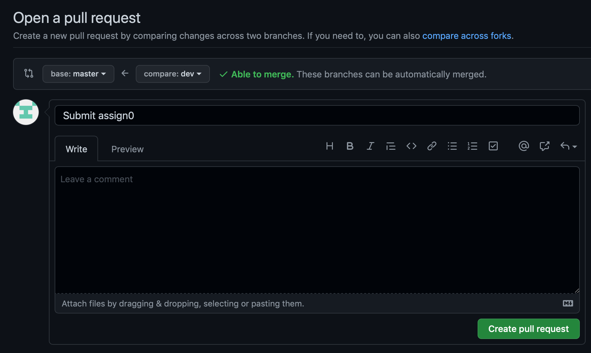

_Written by CS 107E TAs Jesse Doan and Matt Trost with material borrowed from labs and assignments_, 
updated by Maria Paula Hernandez for Spring 2022. 

## Configure `mycode` repo

The following instructions are for the first time git setup of you assignment and 
lab repo, refered to from now on as `mycode` repo.  

Our course repositories will be hosted on GitHub. You will download assignment and lab
starter files from GitHub and upload your completed work to GitHub for grading.  Each student will be given a private assignments and labs repository inside our [CS107e GitHub organization](https://github.com/cs107e).  The repository that resides on GitHub is your __remote__ mycode repo. It will be connected to the __local__ mycode repo on your computer where you will work on the assignments.  Set up the local mycode repo by following the steps below. Be sure to ask for help if you run into any snags.

- __Step 1: Accept GitHub invitations__

    You should have received two email invitations from GitHub: an invitation for read-only access to the starter code repo <https://github.com/cs107e/code-mirror.git> and another invitation for read-write access to your private mycode repo. Once you receive and accept both invitations, you're ready to proceed.

-   __Step 2: Create SSH key and add to GitHub account__

    In order to interact with GitHub from the command line, you'll need set up an SSH
    key on your GitHub account. An SSH key is a way to authenticate
    that you are who you say you are. To create an SSH key, enter the following
    command in your shell:

    ```console
    $ ssh-keygen -t rsa -b 4096 -C "<your_email>"
    ```

    After you press enter, you'll be prompted to choose an alternate name for your
    key. Skip this by pressing enter again. Next, you'll be prompted to enter a
    passphrase for a key. If you want no passphrase, press enter. Otherwise, enter
    your passphrase. If you choose to add a passphrase, you must enter that passphrase each time you push to or pull from GitHub .

    Confirm the key has been created by looking for the key files in your `.ssh` directory:

    ```console
    $ ls ~/.ssh/
    ```

    You should see two files: `id_rsa` and `id_rsa.pub`. SSH uses public-key
    cryptography, which requires a private key and a public key. `id_rsa` is your
    private key and should never be shared. `id_rsa.pub` is your public key and can
    (and should) be shared.

    Now add your new SSH key to your GitHub account by following [these
    instructions](https://docs.github.com/en/github/authenticating-to-github/adding-a-new-ssh-key-to-your-github-account).

- __Step 3: Clone code repo__

    **Note**: In this step and the steps to follow, where you see
`[YOUR-GITHUB-USERNAME]`, replace with your __actual GitHub username__.

    After accepting the GitHub invitation and setting up your SSH key, you can now clone your code repo.
    In your browser, visit the page
    `https://github.com/cs107e/spring22-[YOUR-GITHUB-USERNAME]` to see the contents of your remote repo.
    It should have only a single file: `README.md`, which lists the name of your
    repo and nothing more. Upon confirming this, switch to the terminal and execute
    the following commands to clone the repo, which creates a local copy on your
    machine of the remote repo on GitHub. We recommend that you store your local repo in the parent directory `cs107e_home` that you made during the install process.

    ```console
    $ cd ~/cs107e_home
    $ git clone git@github.com:cs107e/spring22-[YOUR-GITHUB-USERNAME].git mycode
    ```

    Confirm that the local cloned repo matches the remote repo by cd'ing and and examining its contents.

    ```console
    $ cd mycode
    $ ls
    $ cat README.md
    ```

- __Step 4: Create dev branch__

    The master branch in your code repo is write-protected which means
    that you will not be able to directly modify the master branch on GitHub. Instead, you'll create a separate `dev` branch where you will do your work. To create this
    branch, change to your code repo and execute the
    following commands:

    ```console
    $ cd ~/cs107e_home/mycode
    $ git branch
    $ git checkout -b dev
    $ git branch
    ```

    When you run the first `git branch` command, notice how there is only a single
    branch listed: `master` and there is an asterisk next to `master`,
    which means that it is the currently checked out branch. When you run the second
    `git branch` command, you should have two branches--`master` and `dev`--and the
    asterisk marking the currently checked out branch is now next to `dev`.

- __Step 5: Get starter files__

    Next, you must configure your local `mycode` repo to have an additional remote connection to the starter code repo so that it can also synchronize with that repo. Execute the following commands to add a remote for `starter-code`

    ```console
    $ git remote -v
    $ git remote add starter-code git@github.com:cs107e/code-mirror.git
    $ git remote -v
    ```

    After running the first `git remote -v` command, you should have only a single
    remote: `origin`. `origin` is a shorthand way of referring to your remote repo
    on GitHub. The `git remote add` command adds a second remote. This second remote
    is `starter-code`, which is a shorthand way of referring to the starter code
    repo on GitHub. The second `git remote -v` should show you both remotes:
    `origin` and `starter-code` and the URLs that they represent.

    To get the starter files, verify that you're on the `dev` branch and execute the
    following commands:

    ```console
    $ git pull --allow-unrelated-histories starter-code assign0-starter
    $ ls
    ```

    The `git pull` command will open up `vim` and display the message "Merge branch
'assign0-starter' of github.com:cs107e/code-mirror into dev". Confirm
this merge by typing `:x`, which will save and exit `vim`. 

- __Step 6: Create remote branch__

    A few steps earlier, you created a `dev` branch in your repo. Unfortunately, this
    branch is only local. That is, it doesn't exist in your remote repo on GitHub
    yet. Let's fix this now. First confirm that you're on the `dev` branch. Then,
    run the following command:

    ```console
    $ git push --set-upstream origin dev
    ```

    This command creates the `dev` branch on the `origin` remote (your GitHub repo)
and connects this remote `dev` to your local `dev`.

    If you return to your GitHub repo in your browser, you should now find a `dev` branch in the branches dropdown menu.

###Organization of the `mycode` repo
Your `mycode` repo will be organized by lab and assignment. Each lab and assignment 
will have its own subdirectory 'labX' and 'assignX' which will contain all of the code 
required for you to complete your lab and write your assignments. For each lab and assignment, 
you will follow the steps below to get the starter code in your `mycode` repo. 

## Lab workflow
### Get lab starter code

When starting a new lab, do a `git pull` in your `cs107e.github.io` repository to ensure your courseware files are up to date.

```console
$ cd $CS107E
$ git pull
```
Update your local `mycode` repo by checking out the `dev` branch and pulling the lab starter files from the remote (change labX to lab1, lab2, as appropriate):

```console
$ cd ~/cs107e_home/mycode
$ git checkout dev
$ git pull --allow-unrelated-histories starter-code labX-starter
```

After these commands, your repo is on `dev` branch and all files are up to date. `cd` to the `labX` folder and use `ls` to see the new files.

(Note: the `git pull` command may open up your editor and display the message "Merge branch 'labX-starter' into dev". Confirm the merge by saving and exiting the editor.)

You don't need to commit or submit lab code to be graded. The staff will review your code during lab and check off your participation. 

## Assignment workflow
### Get assignment starter code

When starting a new assignment, do a `git pull` in your `cs107e.github.io` repository to ensure your courseware files are up to date.

```console
$ cd $CS107E
$ git pull
```

Update your local `mycode` repo by checking out the `dev` branch and pulling the assignment starter files from the remote (change assignX to assign1, assign2, as appropriate):

```console
$ cd ~/cs107e_home/mycode
$ git checkout dev
$ git pull --allow-unrelated-histories starter-code assignX-starter
```

After these commands, your repo is on `dev` branch and all files are up to date. `cd` to the `assignX` folder and use `ls` to see the new files.

(Note: the `git pull` command may open up your editor and display the message "Merge branch 'assignX-starter' into dev". Confirm the merge by saving and exiting the editor.)


### Assignment commit
You will work on your assignments in your local `mycode` repo. However, you must inform git 
of the changes you made locally. The commands below add the changed file to the staging index, commit staged changes (save to local repo), and push the commit to GitHub (update remote repo):

```console
$ git status
```
The 'git status' command will show you the files you have edited locally that have 
not yet been pushed to your remote repo. Now, lets stage them for commiting using 
the command 'git add'. 

```console
$ git add 'filename1'.txt 'filename2'.c
$ git commit -m "Short but descriptive message about the changes you are commiting"
$ git push
```

Note: using the command 'git add .' will add all changed files to be staged for commit. 

You can use `git log` to view the history of commits in your local repo. When
you enter the log, you can exit out by pressing "q" on your keyboard.

```console
$ git log
```

Also note that you can add multiple files (also called staging) and commit their
changes as a single commit. This is important because you don't ever want your code
to be in an inconsistent or bad state. For example, if you add a new file that
another file references, you want to put those two changes together in a single
commit; the file shouldn't be there if it isn't referenced, and you don't want
code to reference a file that doesn't exist.

Each commit that you make records a snapshot of your work. You can use these
snapshots to review your progress, compare versions, or identify and undo an
unfortunate change. Establishing good commit practices gives you the ability to
navigate the history of code changes, as well as providing the opportunity to
revert to previous versions. Sometimes you may find that you want to revert to
a commit before a set a changes that introduced a bug in your code. The more you
commit, the more opportunities you will have to restore previous working states
without losing as much work. **We recommend that you commit early and often and
that you write detailed commit messages.**

> Git command responses can sometimes look cryptic and scary. DON'T BE SCARED!!!
> Git is your friend :). Reading all the responses from git messages will help
> you understand the commands your running, and prevent you from missing
> important messages about the state of your repo.
> {: .callout-info}

**Note:** GitHub will show commits for `Branch: master` by default. To see the code and
changes for a specific assignment branch, switch to the branch by selecting it from `Branch` drop-down menu :


### Assignment tags

In order to grade your assignments, we'll run tests on your submission to verify that it works as
expected. You identify which commit that we test by using a tag. We'll
also use this tag to determine your submission time. Note that the submission time recorded
will correspond to the time you pushed the tag commit, not the time the tag was 
pushed. In Git, a tag is simply a way of giving a name to a particular commit. 
Create a tag to identify this assignment's submission by doing the following:

```console
$ git tag assignX-submit
$ git push --tags
```

Be sure you always name your submission flag with the format `assignX-submit`
where X is the particular assignment number. Now, go to your repo on GitHub and
verify that your newly created tag shows up in the "Tags" section of the branches
dropdown menu.

If you commit additional changes after creating the tag, you can
move the tag to a later commit with the following command (note that you need to push `--force` when moving a tag that already exists).

```console
$ git tag -f assignx-submit
$ git push --tags --force
```

Additionally, if you complete the assignment extension, please tag the commit 
corresponding to the extension with the tag assignX-extension. This can be the 
same commit as your basic functionality, or it can be a different one. However, 
we will not grade your extension if you have not tagged it. 

See the section below entitled 'Assingment Submission' for a checklist of steps to 
complete when you submit your assignment. 


### Assignment pull request

In this course, assignment submission is done using GitHub's _pull request_
feature. Pull requests provide a summary view of changes made to the code as
well as a section for comments where course instructors will be providing
feedback.

The pull request model is used by many modern software projects to promote good
practices when working in a distributed development environment. The typical
flow starts with a base branch (often called _master_) that reflects the master
copy of the code. Feature development or bug fixing occurs by creating a new
_branch_ where changes are made. Once you're confident that the code in your
branch is polished, tested, and working well, you can ask other people to merge
the commits in your branch into _master_ by making a _pull request_. You've
pushed commits to your branch, you're now asking other people to pull those
commits into master. Team members use the pull request to review the
proposed changes and provide comments. When a team member approves the pull request,
GitHub automatically merges the commits back into the base branch.


You will only have to make a pull request once. After you confirm you have done 
it in this assignment, it will remain open throughout the quarter and allow us to 
grade your assignments. If you accidentally close the pull request, just make 
sure to open a new one following the steps below. 

View the contents of your remote repository on the web at `https://github.com/cs107e/spring22-[YOUR-GITHUB-USERNAME]`.
Switch to the branch `dev` by selecting it from the "Branch" drop-down
menu.

Click the 'Compare & Pull Request' button.


If the 'Compare & Pull Request' button isn't available, click 'Contribute', then 
'Open Pull Request'. 

Now you will see text entry boxes for describing the pull request, followed by
a list of the commits that you have made and a line-by-line comparison (`diff`)
of the changed files.

Set the Title to "Submission Pull Request" and leave the description blan. 


Click 'Create pull request', which will submit the pull request and take you to
a page to view it:


The pull request page will update to reflect any changes that are pushed after
the initial submission. This page will also be used by graders to provide feedback
on your submissions.

If you need to update your submission simply edit your files, commit, retag, and push to add
it to the pull request. There is no need to make another pull request. Rember to only 
retag with assignX-submission if you are resubmitting before the deadline to avoid 
getting marked as late. Past the deadline, please use the convention assignX-submission-update. 

### Assignment submission

This guide contains a lot of information. The following is a checklist to follow when 
you are submitting your assignments. 

Submitting your assignments before the deadline, or during the grace period: 
1. Ensure all of your code is committed and pushed (See section 'Assignment Commit' 
2. Tag your code with 'assignx-submit' (See Section Assignment Tags') 
3. Tag your extension with 'assignX-extension' 
4. Ensure you have an open Pull Request (See Section 'Assignment Pull Request', though 
you do not have to follow the steps again as long as you have a pull request open) 
5. If you edit your code before the grade period deadline, make sure to commit again and move your 
tags to the correct commit as outlined in 'Assingment Commit' 

Submitting your assignment after the grace period deadline or resubmitting your code: 
1. Ensure all of your code is committed and pushed. 
2. Tag your code with 'assignX-retest' 
3. Ensure you have an open Pull Request.  

|
### Assignment grading feedback

Functionality Grades: 

When your code is run through the autograder and released to your repo, the bugs in 
your code will be recorded in the 'Issues' tab in your remote Github repository. 
When you click on the tab, you will encounter a list of your open issues and a link 
to your assignment logs. If you click on the logs, the output generated from your code by
the autograder will be displayed to you. Additionally, your logs folder will contain 
the output of the staff implementation generated by the autograder. Comparing the staff 
output to your own will give you insight as to why your code failed the provided test. 
As you fix your bugs and submit your debugged code, the issues will be closed in the 'Issues' 
tab and the logs will disappear from your logs folder. Your goal will be to close all 
high priority issues. The next section will describe how to resubmit your code when you 
have fixed your bugs. 

You will be able to see your grades for each assignment in the README.md document 
of your master branch. 

Style grades: 

In order to view your style grades, you will click on the 'Pull Requests' tab of your remote 
Github repo, then click on the open pull request. The CAs will have left comments on your style in tests 
that you will be able to find in the 'Conversation' tab of the Pull Request landing page. 

###Assignment retest

After the assignment deadline, you may resubmit your code in order to correct 
your bugs. In order to do so, please tag the updated commit 
that you would like us to grade with the format `assignX-retest`.
This will be the only tag we grade for assignments past their deadline.
You may do this as multiple times as you make further changes. 
Note that every time you make additional changes after creating the tag you must move the tag 
to the commit that you want graded as outlined above in the section 'Assignment Tags'
. Each time we run your code, we will check if the tag has been updated and if so, run your submission through the 
grader and communicate the updated grade to you. This will update your 'Issues' as well 
as your logs folder as you 'close' issues by fixing the bugs. 

Note that not all code is eligible for resubmission. 

Code that is eligible for resubmission: 
1. Basic functionality for assignments 2-7. 

Code that is not eligible for resubmission: 
1. Extensions 
2. Style/Tests 
3. Assignment 1 code and clock functionality code for assign2 (note that for assign2, 
you may resubmit code to fix your GPIO library, but your clock functionality will
only be graded at the deadline). 

