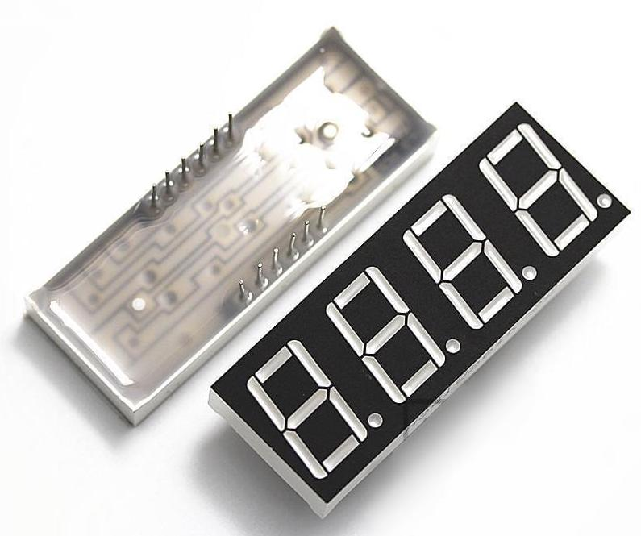
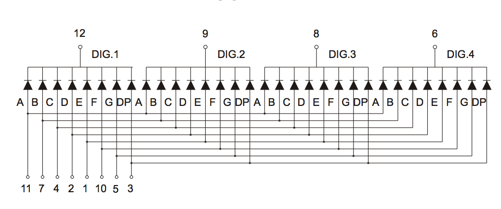
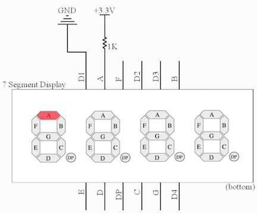
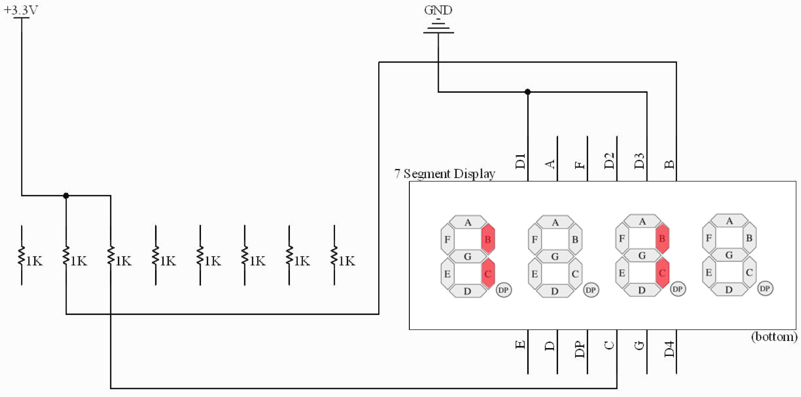
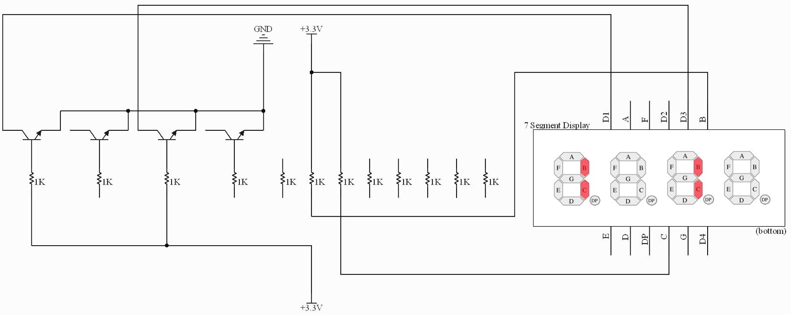
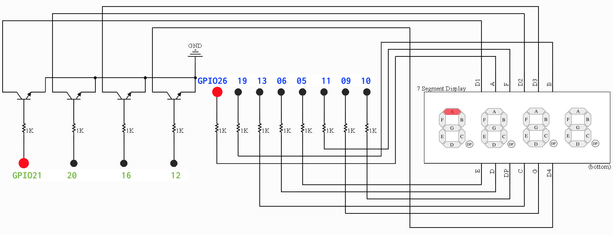
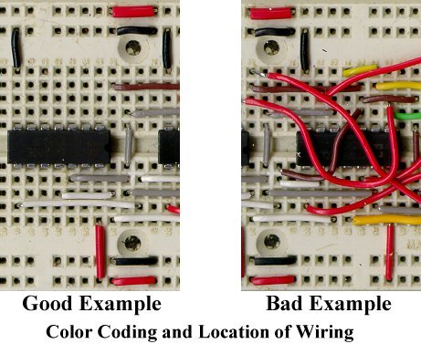


Task list to copy/paste when creating PR for this lab:

__Before releasing lab2:__
- [ ] Review writeup/code/checkin questions (instructor)
- [ ] Walk through (SL)
- [ ] Followup on issues from previous quarter postmortem (issue #382)

__To prep for lab2:__
- [ ] See private/answers and private/staff_notes for advice saved from past
- [ ] Forum announcement for students to bring their own tools (also repeated in prelab)
- [ ] Confirm lab cabinet has plenty of hookup wire and hand tools
- [ ] Make copies of 7-segment pinout diagram to distribute in lab



{: .w-50 .float-right}

<br/>
*Lab written by Pat Hanrahan*

---
<br/>
## Goals
During this lab you will:
- Read the assembly language produced by `gcc` when compiling a C program.
- Review the use of basic makefiles.
- Learn how to unit test your C program.
- Begin breadboarding a 4-digit 7-segment display for your next assignment, the clock.

## Prelab preparation

To prepare for this lab, please do the following:

1. Organize supplies to bring to lab: your laptop and entire parts kit.
    -  You will also need hookup wire and hand tools for breadboarding, these are available in lab. You can also bring your own tools if you have them.  
2. From our course guides, please review:
    -  [gcc guide](/guides/gcc) on compile C programs for bare metal
   programming on the Raspberry Pi
    -  [make guide](/guides/make) on the structure of makefiles
3. Read [section 4a below](#crossref) on the theory of operation
   for 7-segment displays. If you have time, skim the rest of exercise 4 to get the lay of the land for the breadboarding work.

## Lab exercises

First things first: join a lab table and make introductions. Congratulate each other on completing the first assignment. Celebrate your bare metal mettle! 💪

This lab has four exercises and we recommend that you spend no more than 20 minutes each on the first three, reserving the second hour of lab for the breadboarding task. We want you to leave lab with a solid start on the hardware setup needed for your next assignment.

### Lab Cadence: 

#### Nice to have:

1. C to Assembly 
2. Makefiles 
(The first two lab exercises are important, but you can finish looking over them at 
home. That is, when you reach the recommended time, move on so you have time for the 
mandatory lab sections). 

#### Obligatory: 
3. Testing 
4. Wire up display breadboard 
(These two sections will be crucial in getting started with Assignment 2. Exercise 3
will walk you through how to test your assignment. Exercise 4 is important for you to begin and 
make headway with in lab, as the clock will be necessary for your assignment. You don't have to 
finish the breadboarding in lab, but it is important for you to get a solid understanding before you leave.) 

### 0. Pull lab starter code

Before starting each new lab, first do a `git pull` in your $CS107E repository to ensure the courseware files are up to date.

```console
$ cd $CS107E
$ git pull
```

Now cd to your local `mycode` repo and pull in the lab starter code:

```console
$ cd ~/cs107e_home/mycode
$ git checkout dev
$ git pull --allow-unrelated-histories starter-code lab2-starter
```

### 1. C to assembly (20 min)

Compilers are truly an engineering marvel. Converting a C program into a fitting use of assembly instructions, registers, and memory necessitates both technical mastery and a fair bit of artistry. From here forward in the course, you'll hand over to the compiler the task of writing assembly, but you will continue to grow your fluency reading and understanding assembly. For this exercise, you will observe and pay tribute to the handiwork of the compiler.

Sometimes the assembly
produced by the C compiler can be surprising. You will be pleased by its clever optimizations, although occasionally its eagerness can also remove or rearrange your code in ways that confound your intentions. When this happens to you, you can deploy your ARM superpowers to dig into the generated
assembly and figure out what the compiler did rather that sit
there dumbfounded by the unexpected behavior!

Change to the `lab2/codegen` directory. Open the `codegen.c` source file in
your text editor. The file contains functions that concern different aspects of C such as arithmetic, control flow, and pointers. Skim the C code and read our comments.

Pull up <https://godbolt.org/z/7M4cfKf1b> in your browser; this is Compiler Explorer configured to match our toolchain:  `C` language, compiler version `ARM gcc 9.2.1 (none)` and split output windows to show compiled result at different different optimization levels (`-Og` and `-O2`).

In `codegen.c`, find the section marked `Part (a): arithmetic`. Paste the functions into the Compiler Explorer source pane on the left and review the generated assembly shown in the right panes. Verify that the assembly accomplishes what was asked for in the C source. Do you note any surprising choices in how it goes about it?  Read our comments in `codegen.c` as the guide for what to look for and follow-up experiments to try. 

After you finish exploring Part a, do the same with the other parts in `codegen.c`.

The final part includes some C code for which the generated assembly is somewhat surprising -- examine those closely to understand what is happening and why. The handling of "undefined behavior" can be particularly wacky. When asked to compile C code that ventures outside the boundary of legal C, the compiler has complete freedom. Check out this article for more examples <https://embeff.com/compiler-dependent-behaviour-in-practice/>

A good way to learn how a system works is by trying
things. Curious about a particular C construct is translated to assembly? Wonder about the effect of changing the compiler optimization level? Try it out and see. Let your curiosity be your guide!

### 2. Makefiles (20 min)

Change to the directory `lab2/makefiles` and view the C version of the blink program and its simple Makefile, reproduced below:

```
    NAME = blink

    CFLAGS = -g -Wall -Og -std=c99 -ffreestanding
    LDFLAGS = -nostdlib -e main

    all: $(NAME).bin

    %.bin: %.elf
        arm-none-eabi-objcopy $< -O binary $@

    %.elf: %.o
        arm-none-eabi-gcc $(LDFLAGS) $< -o $@

    %.o: %.c
        arm-none-eabi-gcc $(CFLAGS) -c $< -o $@

    run: $(NAME).bin
        rpi-run.py $<

    clean:
        rm -f *.o *.elf *.bin
```

Discuss and document the various features and syntactical
constructs used in this Makefile.

 - What is the meaning of the entries listed in `CFLAGS`?
 - What happens if you just type `make`? Which commands will execute?
 - If you modify blink.c and run `make` again, which commands will re-run?
What part of each target indicates the prerequisites? (A prerequisite means
that if that file changes, then the target is stale and must be rebuilt)
 - What do the symbols `$<` and `$@` mean?

You should be able to answer the check-in question about makefiles[^1] now.

### 3. Testing (20 min)
<a href="testing"></a>
An effective developer knows that testing your code goes hand-in-hand with writing it. The better your tests and more timely your efforts, the sooner you will find your bugs and the easier your debugging will be. To help you grow this important skill, upcoming assignments will include a required testing component along with our guidance on testing structure and strategies..

The standard C library offers an `assert` macro for use as a simple diagnostic. Run the command `man assert` in your Terminal to read about the standard library version. The `assert` macro takes an expression that is expected to evaluate to true. If the expression is, in fact, true, then the assertion succeeds and the program continues on.  If the expression is false, the assertion fails which cause the program to print an error message and exit. In CS106B, you may have used the C++ SimpleTest framework and writing test cases using `STUDENT_TEST` and `EXPECT`, the C `assert` serves a similar purpose for writing test cases, but with a more primitive feature set.

Running bare metal means no standard libraries, and furthermore we don't have printf (yet!). To get something akin to `assert`, we have to cobble it up ourselves and given our limited resources, it will be rather primitive.  There are two LEDs built onto the Raspberry Pi board that we will use to signal success and failure. One is a red LED labeled __PWR__; by default this LED is lit whenever the Pi is receiving power. There is also a green LED labeled __ACT__ that we have used by the bootloader heartbeat.  Our bare bones `assert` is going to co-opt these LEDs for its own purposes and blink the red LED to report a failure and turn the green LED steady on to report total success. 

Let's walk through an example that shows using assertions as rudimentary testing tool.

#### A buggy program

Change to the `lab2/testing` directory. The program in `testing.c` defines the `count_bits` function to count the on bits in a given number.  Each test case in `main()` calls `count_bits` on an input and asserts that the result is correct. The code in `count_bits` works correctly for some inputs but not all. Don't try to work out the bug by inspection, instead let's see how we can using testing to determine which test cases are failing.

#### What do you expect?

First, let's review what we expect to
happen when executing the test program. If a test case fails, the `assert` macro will call `abort`. What does `abort` do? Read the comments in the file `testing.c` to find out!

Now look at the code in the file `cstart.c` to see what happens after the
program runs to completion, i.e., what follows after `main()` finishes?. (For now, you can gloss over the `bss` stuff: we will talk about that in lecture soon.)

Testing your understanding. What do you expect to see on the Pi :
- if the program has a single test case of `count_bits` on a value that triggers its bug?
- if the program has a single test case of `count_bits` on a value that works correctly?
- if the program has several `count_bits` test cases, some which pass and some which fail? 
  + This last one is a particularly important detail to note. Unlike SimpleTest, a sequence of test cases (asserts) does not produce a report of pass/fail results, one per test. It stops at the first failure.

#### Run tests

Use `make` to build the program as-is and `rpi-run.py testing.bin` to execute on the Pi. You get the blinking red LED of doom. Hmmm, so at least one test failed, but which one?

It's time to divide and conquer. Leave in the first half of the test cases and comment out the remainder. Rebuild and re-run. If it fails, you know you have a culprit(s) in the first half; otherwise you can move on to looking in the second half. The strategy is to iterate, selectively commenting in/out
test cases and re-running to narrow in on which specific cases fail.
How many of the test cases pass? How many fail?  Which ones? Why?

Study the test results to identify the pattern to the failures. Use that information to find and fix the bug in `count_bits` so that it works correctly for all inputs.

Keep in mind that your test cases are implemented as code, which means that they, too, can have bugs of their own. Having a bug in your test case can truly be a maddening experience! A test case that produces a false negative can lead you to investigate a non-existent defect and a false positive lulls you into overlooking a lurking one. You attribute the erroneous test result to the code being tested, yet the real issue is that the test case itself is misconstructed. Unlike hackneyed sitcom plots, hilarity does not ensue from this misunderstanding. 

A test case that is properly constructed must asserts an expression that should be true for correct code. The last test case in `main` shows an example of a misconstructed test case. What happens when running this test case on the original broken code? What happens on the now-corrected code? Fix the error in the test case so that it works as intended.

Uncomment all test cases, rebuild, re-run, and bask in the glow of the green light of happiness!

#### Make run

Phew, typing out `rpi-run.py testing.bin` so many times was
a chore! Add a recipe for
`run` to the Makefile that will build and run
the program with the single command `make run`. Make sure that the dependencies for the run target are configured to trigger a rebuild of the program when needed.

You're ready for the check-in question about unit tests.[^2]


<a name="crossref"></a>
### 4. Wire up display breadboard (60 min)

The second half of the lab period is devoted to wiring up the breadboard circuit needed for Assignment 2, a clock implemented on a 4-digit 7-segment display.

The lab exercise below guides you in stages and has you test each stage before moving on.
This "test as you go" strategy is the hallmark of a great engineer. Do not cut corners in a mad rush to finish the entire circuit in lab! The goal for the lab session is that you understand the schematic, get a good start on wiring it up, and have a solid plan for completing the rest on your own.

#### 4a) Theory of operation

Start by understanding how a single 7-segment display works.
{: .float-right .d-inline}
The 7-segment display, as its name implies, is comprised of 7 individually lightable LEDs, labeled A, B, C, D, E, F, and G. There is also a decimal point labeled DP. Each segment is an LED. Recall that an LED has an anode and a cathode. The polarity matters for an LED; the anode voltage must be positive relative to the cathode for the LED to be lit. If the cathode is positive with respect to the anode, the segment is not lit.

On the 7-segment displays we are using,
the cathodes (ground) are all connected together,
to a single ground.
Such a display is called a *common cathode* display.

{: .zoom}

To display a digit, you turn on the appropriate segments by connecting the
common cathode (ground) to ground and applying a voltage to those segment
pins. Turning on all seven segments would display the digit `8`.

Your clock will display minutes and seconds, using two digits for the minutes and two digits for the seconds,
for a total of four digits.
The clock display in your kit has four 7-segment displays integrated into a single unit:

{: .zoom .w-25}

Here is the schematic for the four-digit 7-segment display:

{: .zoom .w-75}

Untangling the schematic can be a bit tricky. There are twelve pins in total: four digit pins (`DIG.1`, `DIG.2`, `DIG.3`, and `DIG.4`) and eight segment pins (`A`, `B`, `C`, `D`, `E`, `F`, `G`, `DP`). Each segment pin connects to all four digits; trace from the pin numbered 11 to see the connections to the `A` segment for each digit. Each digit has its own unique ground, e.g. `DIG.1` is the cathode/ground pin for digit 1. Trace how each of eight segments connect to this shared ground.

If you turn on segment pins `B` and `C` and connect `DIG.1` and `DIG.2` to ground, the first
and second digits both display `"1"` while the third and
fourth digits do not display anything, because they are not not connected to ground.

The photo below shows the placement of the pins on the display. Note that the `DIG.1`,
`DIG.2`, `DIG.3`, and `DIG.4` labels have been shortened to `D1`, `D2`, `D3`, and `D4`. The pins are also numbered for reference. By convention, numbering starts at the bottom left corner (pin #1), and proceeds in a counter-clockwise fashion until reaching the upper left corner (pin #12).

{: .zoom}

#### 4b) Wire up resistors/segments

In steps 4b and 4c, you will connect your display pins and test
them. For ease of debugging, we recommend that you first connect your display using jumper cables. After validating your circuit, you will re-wire it in
a neater and more permanent fashion.  Remember to take care that your breadboard is disconnected from power whenever you are fiddling with the wiring.

> When using the wire stripper, be sure to place the wire in the numbered hole that corresponds to the wire's gauge. The wire used for breadboarding is typically 20, 22, or 24 AWG; read the label on the wire spool to identify the gauge you are using.
{: .callout-info}

First, connect the two power rails and two ground rails on your breadboard using red and black wires cut to the right length. This makes accessing power and ground via jumpers more convenient. My convention is to always orient my breadboard so that the blue ground rail is on
the bottom (after all, ground is always underneath us).

{: .zoom }

Want to see how you can use your tools to get a tight fit? Watch our staff fit a wire between two set points.


Now insert the display on the far right edge of breadboard. Make sure the display is
oriented correctly: the decimal points should be on the bottom, and the digits
slanted to the right.

Take note of the column numbering on your breadboard when you place your
display. Knowing which breadboard column number aligns with each pin is helpful since after you insert the display into the breadboard you can no longer
see the pins underneath. We chose to place our display so __pin 1 of the display is aligned with column 50 on the breadboard__.

The display LEDs require a current-limiting resistor just as the LEDs in your larson scanner did. Place a 1K resistor on the board bridging the
middle. The resistor should sit neatly---here's an example of how the staff uses the pliers to make a sharp crease and clips the leads with the cutters for a nice secure fit.


Use a pair of red and black male-female jumpers to connect the power and ground rails of the breadboard to the 3.3V and Ground
pins on your Raspberry Pi. Pick out three short male-male jumpers (orange for 3.3V, black for GND, and green). Use the orange jumper to connect the top of
the resistor to the red power rail. Use the green jumper from the bottom of the resistor to
segment A (Pin 11, which will be at breadboard columns 51 if you aligned Pin 1
to column 50 as described above). Use the black jumper to tie digit D1 (Pin 12, column 50) to the ground rail. When you apply power to your Raspberry Pi, segment A of
digit 1 should light up as shown below:

{: .zoom}

You can change which segment and digit is lit by moving your jumpers to different pins. Move
your segment jumper to light up segment B instead of segment A. Move your
digit jumper to light up segment B of digit 2 instead of digit 1. Add an
additional jumper to light up segment B of **both** digits 1 and 2.  Note
that you cannot simultaneously display different segments on different digits:
Why not?

You and you partner should now discuss check-in question on the 7-segment display[^3] and confirm with the TA before moving on.

For the remainder of the lab, the photos of the sample breadboard will be accompanied by
_circuit schematics_. Below is the schematic for the breadboard circuit
shown above. Take a moment to identify all of the components in the schematic.

{: .zoom}

Now place seven additional 1K resistors on your breadboard, bringing the total to eight, one for each segment. We
suggest the convention that the leftmost resistor controls segment A, and so
on such that the rightmost resistor controls segment DP. After you add the
resistors, test your circuit. Simultaneously wiring up all segments with 8
jumper cables can be messy; instead use a pair of jumpers to wire up 2 segments
at a time and move the jumpers to test all 8. As you go, you may want to make a
sketch of the correct connection between each resistor and its display pin you
can refer to when wiring up the permanent circuit.

Wire up your jumpers to display the pattern `"1 1 "`, just as in
the schematic below. Here a space means that the digit is blank (no segments
turned on).

{: .zoom}

{: .zoom}

#### 4c) Wire up transistors/digits

Up to now, you have been controlling whether a digit is on by adding or
removing a jumper that connects the digit pin to ground. We eventually want to
control which segments and digits are turned on using the Raspberry Pi GPIO
pins, so we need an electronic switch that can be controlled by these pins.
To do this we will use bipolar-junction transistors, or BJTs.

A transistor has three terminals— the base (B), collector (C), and emitter (E).
The base controls the amount of current flowing from the collector to the
emitter. Normally, no current flows from collector to emitter. This condition
is an open circuit. However, if you apply 3.3V to the base, the collector will
be connected to the emitter and current will flow. This is equivalent to
closing the switch.

We will be using 2N3904 transistors. The following diagram identifies which
pins on the 2N3904 are collector, base, and emitter.

{: .zoom .w-25}

The transistor cap has a flat side and a rounded side. If you are looking
at the flat side with the legs pointing down, the leftmost leg will be the
emitter.

Instead of wiring a digit pin directly to ground as before, you will connect the digit pin to the collector of a transistor whose emitter is connected to ground.
Now applying power to the transistor base activates the switch and grounds the
digit pin.

First, disconnect the direct connections from your digit pins from ground.
Place the four transistors in your breadboard. We suggest arranging your
transistors such that the leftmost transistor controls digit pin D1 and the
rightmost controls pin D4.

Now connect D1's transistor. Wire the collector to D1 and the emitter
to ground. Connect the base to the control voltage through a 1K
current-limiting resistor.

Apply power to the base of the transistor.
You should see `"1 ‍ ‍ ‍ "` on the display.

Here's a board and matching schematic where we've connected _both_ D1 and D3 to
the collectors of transistors and applied power to the bases of those two
transistors. This circuit displays `"1 1 "`.

{: .zoom}

{: .zoom}

Test your transistor-controlled display by turning on each digit
individually to display a `1`.

#### 4d) Permanently wire circuit (start now, finish later)

Now comes the time-consuming part. Each segment pin needs to be connected to
its resistor and each digit pin connected to the collector of its transistor.
Be patient, this takes some time. Rather than do a rush job to finish in lab, 
instead practice with neat and careful wiring to get the hang of it. Carefully
review the schematic and ask questions about anything you find unclear. We want
you to leave lab with confidence that you can finish the rest of the circuit on your own.


Here's a photo of what it should look like before wiring...

{: .zoom}

...and here is a full schematic of what you will be wiring up:

{: .zoom .w-75}

In the diagram above, the 3.3V input we've been using up to this point has been
replaced by labeled dots where you will connect M-F jumpers from the GPIO pins on the Pi. The dots labeled in blue are the GPIOs that control the segments, the dots labeled in green are those for the digits. For example, setting GPIO 26 and 21 to high will light the top
segment of the first digit.

The finishing touch is to add a pushbutton on the left edge of the breadboard to be the start button for the clock. The button is not connected into the display circuit. It will be wired to the power rail through a 10K pull-up resistor and connected to the GPIO pin 2 on your Raspberry Pi to be read as an input. Review the [button exercise from lab1](/labs/lab1#button) if you were not able to get to it last week.

When you wire your breadboard, be sure to cut wires to the proper length and arrange them neatly. Select different colors of wires to annotate what each is used for. If they're neat, it's easier to see if everything is set up correctly. Take your time and check your work. A little bit of care here will save you a lot of time later, because, when your system has a bug, the set of things that you have to check is much smaller.

{: .zoom}

Here is a photo of Pat's completed breadboard. What a masterpiece! (Note the second button is optional and only used in the assignment extension.)

{: .w-75 .zoom}


## Check in

Be sure to check in with us during lab. We want to confirm that you make a solid start on your clock breadboard and a clear understanding of how to complete the remaining tasks on your own.

__Please take care to tidy up & leave your workspace as clean as you found it!__

[^1]:  Using the Makefile shown in exercise 2, trace what happens when you issue `make` with no command-line arguments. What target does `make` try to build? How does it determine which actions to take to build that target?

[^2]:  You run a program with a sequence of 10 asserts on the Pi and get the flashing red light of doom. Describe your strategy to narrow in and identify which test case(s) is failing. What happens if the program has a bug in a test case that causes it to enter an infinite loop-- what then would you expect to be the observed behavior when testing?

[^3]:Which pins must be connected to show `"3"` on the first digit? Which additional pins much be connected to show `"3333"` across all four digits? Why is it impossible to simultaneously show `"3"` on the first digit and `"4"` on the second? (The trick to doing so, as you will see in the assignment, is to quickly switch between digits to create the illusion of displaying `"34"`)


