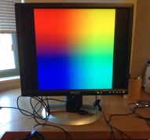
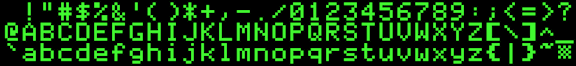


Task list to copy/paste when creating PR for this lab:

__Before releasing lab6:__
- [ ] Review writeup/code/checkin questions (instructor)
- [ ] Walk through (SL)
- [ ] Followup on issues from previous quarter postmortem (issue #)

__To prep for lab6:__
- [ ] Confirm there are sufficient number of working monitors, HDMI cables, and HDMI-DVI adapters (aim for 1 setup for every 2-3 students)



*Lab written by Philip Levis and Pat Hanrahan*

## Goals

For your next assignment, you will implement library of simple graphics routines and use them to implement a text console for your shell. The goal of this lab is to review concepts and code in preparation.

During this lab you will:

- Connect your Raspberry Pi to a monitor and generate video
- Read and understand the mailbox and framebuffer code
- Review C syntax for pointers to multi-dimensional arrays
- Read and understand fonts and the representation of characters

## Prelab preparation
To prepare for lab, do the following: 

- Pull the latest version of the `cs107e.github.io` courseware repository.
- Clone the lab repository `https://github.com/cs107e/lab6`.
- Review the code shown in the [framebuffer lecture](/lectures/Framebuffer/slides.pdf).
- Extra supplies needed in lab this week:
    - __HDMI cable__ (we will give you one in lab)
    - __HDMI display__ (computer monitor, tv, or projector that accepts HDMI input)

## Lab exercises

### 1. Confirm your display (5m)

Plug one end of the HDMI cable into the HDMI port on the Raspberry Pi and the
other end to the HDMI input of your display. If you are using a monitor in lab,
you will additionally need an HDMI-to-DVI adapter, since our monitors are older
and only accept DVI inputs, not HDMI. Power up your Pi and you should
see the following test pattern:

{: .zoom .w-25}


If you connect your Raspberry Pi to a monitor, TV, or projector, the default
test pattern is displayed. 

Be sure that each of you connect your Pi to a monitor to confirm the test
pattern. For the rest of the lab, partners can share one Pi/monitor.

While working on your assignments, you are welcome to come to the lab room to
use our monitors or use any HDMI-capable display that you have access to.
Please do not remove monitors or take our cables/adapters; these should remain
in the lab room for all to use.  

### 2. Draw pixels (40m)

Change to the directory `code/grid` and build and run the grid program using
`make run`. The monitor should now display a grid of white lines.

Open the `grid.c` file in your text editor and modify the program in the following three ways:

1. Change the video resolution to 1024 by 768, and redraw the grid.

2. Change the grid code to draw horizontal lines in red and vertical lines in yellow.
   *Remember from lecture that the B (blue) in BGRA is the lowest byte.*

3. Change the grid code to draw a checkerboard pattern 
   (alternating filled black and white squares). Hint: define a helper function
   that draws a rectangle. 

Remember that C has no bounds-checking on array indexes. Writing to an index
outside the bounds of the framebuffer will corrupt that data at that location.
The memory neighboring the framebuffer is in use by the GPU and if you corrupt
it, the transgression is punished in mysterious ways (screen garbage, a
surprise reshowing of the Pi test pattern, lockup of GPU that requires reset of
Pi). If you observe strange behavior you should review how your code accesses 
the framebuffer memory.

Check-in with us and show off your checkerboard. [^1]

### 3. Study fb and mailbox code (40m)

The _framebuffer_ is a contiguous block of memory that stores pixel data; this
memory is shared between the CPU and GPU.  When the CPU writes to the
framebuffer, the GPU reads the new data and displays the updated pixels on the
screen.

The CPU and the GPU communicate about the framebuffer via a mailbox mechanism.
The CPU composes a message to memory and sends to the GPU by putting the
message address into the mailbox. The _mailbox_ is a set of hardware registers
that can be accessed by both processors. 

#### The framebuffer configuration message

Change to the directory `code/fb`. The directory contains these files:

```console
$ ls
Makefile      fb.c        fb.h        mailbox.c     mailbox.h    main.c
```
The file `fb.c` contains code to initialize the framebuffer by sending a
configuration message to the GPU. The configuration message is represented by
the struct `fb_config_t`.

The CPU writes these struct fields when sending the message:
- __physical size__: requested width/height for the physical screen.
- __virtual size__: requested width/height of pixel data in framebuffer. The
  virtual size can differ from the physical size, and if so, the virtual image
  will be scaled when displayed on the physical screen.
- __bit depth__: requested number of __bits__ per pixel
- __offset__: requested location within framebuffer for upper left corner of
  screen image (0 for now)
- All other fields should be set to 0 (GPU will set these fields in response)

The CPU uses `mailbox_write` to send the configuration message to the GPU. It
then must call `mailbox_read` to receive the GPU's response. If the return
value from `mailbox_read` is 0, this confirms the request was satisfied and the
GPU has filled in values to the remaining struct fields. A non-zero result
indicates the GPU cannot support the requested configuration and your graphics
are in a confused/indeterminate state. The convenience function
`mailbox_request` is a call to a `mailbox_write` followed by `mailbox_read` to
read the mailbox until the GPU sends a response. The response is stored
in the `fb_config_t` struct whose address was put into the `write` register
of the mailbox.

The CPU reads these fields from a successful GPU response message:
- __framebuffer__: address of the start of the framebuffer in memory.
- __total_bytes__: total number of bytes allocated to the framebuffer.
- __pitch__:  number of __bytes__ in each row of the framebuffer. The pitch is
  at least equal to the virtual width multiplied by the pixel depth in bytes.
  The pitch will be larger when the GPU has added padding at the end of each row
  for alignment reasons.

Review the code in the `fb_init()` function. Discuss with your tablemates and
try to answer the questions below.

   1. What is the difference between physical size and virtual size?
   2. What is the difference between width and pitch?
   3. Why is `fb_config_t fb` aligned to a multiple of 16?
   

#### GPU mailbox code
The CPU and GPU communicate by composing a message in memory and writing the
address of the message into the hardware register for the mailbox.  When the
sender places a message in the mailbox, it is considered *full*.
When the message is read by the receiver, it becomes *empty*. 

Overall, the communication pattern we'll be using is:
* The CPU starts the exchange by creating a message 
  and putting a pointer to that message in the mailbox. The mailbox is now full.
* The hardware alerts the GPU to read the message, which empties the mailbox.
* After processing the message,
  the GPU responds by putting a return message in the mailbox 
  (filling it again) for the CPU to read.
* Meanwhile, the CPU is waiting at the mailbox for the GPU's response.
  When the mailbox status changes to full, the CPU reads the return message from the GPU.

Fill in the code for `mailbox_read`. This function should:

  1. Check that the channel is valid (see `mailbox_write` for how to do this).
  2. Spin-wait until the `MAILBOX_EMPTY` flag in the mailbox `status` register
     is cleared (meaning there is data in the `read` register).
  3. Confirm that the lower 4 bits of the `read` register are the same as
     the channel: if not, wait for another message in the mailbox (step 2).
  4. Return the upper 28 bits of `read` shifted right 4 bits

Test your read by running the `fb` application. The mailbox code is a little
tricky -- it can seem like it's working, but might have subtle bugs that you
only find when you're deep in your graphics assignment. So call a TA over 
to read over your `mailbox_read` to check that it's right.

You're ready to answer the check-in question[^2] about the mailbox.

### 4. Multi-dimensional arrays (30m)

Pointers are ubiquitous in systems programming in C and one of the most
difficult concepts to master. Just when you are getting the hang of pointers
and one-dimensional arrays, now we're adding multi-dimensioned arrays into the
mix. The goal of this lab exercise is to review pointers and multi-dimensional
arrays in preparation for your next assignment.

One convenient way to represent images is with a two-dimensional array.
Treating it as a 2D array can be easier than explicitly calculating offsets
into a one-dimensional array.

To start, here is a quick self-test:

* What is the difference between the following two declarations?
  Think about what operations are valid on `a` versus `b`. Also
  think about what memory is allocated.

      char *a  = "Hello, world\n";
      char b[] = "Hello, world\n";

* What is the difference between the following two declarations?

      int *p[2];
      int (*c)[2];

  You may find the **[cdecl tool](http://cdecl.org/)** helpful in demystifying a complex C declaration.

Inspect the code in `code/pointers/pointers.c`. Compile the program using
`make`, run it on your Pi, and interpret the results. Ask questions about
anything that doesn't make sense to you and check-in with us to confirm your
understanding. [^3]

### 5. Fonts (15m)

A major part of your assignment will be to draw text on the screen.
In order to do this, you need a *font*. Each character in the font is a little
picture that represents the glyph to draw. 

{: .zoom .w-100}

This famous font was used by the original Apple IIe. We chose it to
provide that extra-special retro touch for your graphical console.

Review the file `$CS107E/src/font.c`. It declares a `font_t` struct for representing a font and
defines the variable `font_default`:

```
/* from font.c */
typedef struct  {
    unsigned char first_char, last_char;
    unsigned int  glyph_width, glyph_height;
    unsigned char pixel_data[];
} font_t;

static const font_t font_default = {
    .first_char = 0x21, .last_char = 0x7F,
    .glyph_width = 14, .glyph_height = 16,
    .pixel_data = {
        0x03, 0x00, 0x33, 0x00, 0xcc, 0x00, 0xc0, 0x3c,
        0x00, 0x30, 0x00, 0x30, 0x00, 0xc0, 0x03, 0x00,
        ...
        0x3f, 0x00, 0x00, 0x00, 0x00, 0x03, 0x00, 0x00,
        0x00, 0x00, 0x00, 0x00
     }
 };
```

The pixel data for the character glyphs is stored as a bitmap.  In a bitmap,
each pixel is represented by a single bit. If the bit is 'on', the pixel is to
be drawn in the foreground color; if 'off', the pixel is set to the background
color. We use a bitmap rather than full RGBA because it takes much less (32
times less) memory. This makes the font data much smaller, and hence faster to
upload to your Raspberry Pi.

Below is a pictorial representation of `font_default` using green to display
each 'on' pixel in the bitmap. (click the image to see larger version):

{: .zoom .w-100}

The font bitmap stores the character glyphs in a single line. The leftmost glyph is for the
character '`!`', whose ASCII value is 33 (0x21), the neighboring glyph is for
character '`"`' (ASCII 34) and so on ending with rightmost character ASCII
value 127 (0x7f) Delete, whose glyph is a little checkerboard. The font bitmap
contains glyphs for 95 total characters, from ASCII 33 to 127.

Each glyph is the same size: 14 pixels wide and 16 pixels tall.  This is termed
a *fixed-width* font.

The bitmap is stored using an array of `unsigned char`
values. For example, the first two bytes in the array are `0x03, 0x00`.  Group
the 8 bits from the first byte and 6 bits from the second into the 14-bit
sequence `0b00000011000000`.  These 14 bits correspond to the top row of the
first glyph, the exclamation point. The bits indicate the vertical line for 
the exclamation point is 2 pixels wide and positioned in the center. 

Each line of the bitmap is 1330 pixels long (95 characters * 14 pixels wide),
and requires 1330 bits. If each glyph is 16 pixels tall, how many total
bytes are in the `pixel_data` array?

Look carefully at the function `font_get_glyph()` in `font.c` which copies a
single glyph from the font bitmap into a buffer.

* Trace the operation of `font_get_glyph` for ASCII character `&` (ascii hex
  0x26)? At what locations in `pixel_data` does it look to find the appropriate
bits? 

Now change to the directory `code/banner` and review the code in `banner.c`.
This program calls `font_get_glyph` to store the glyph image into `buf`. The
code then wants to go on to access `buf` as a 2-d array through the variable
named  `img`, but `img` is missing its declaration and initialization. Read and
follow the instructions marked `TODO:` to fix this issue. Compile and run and
you'll get an ascii banner that prints letters to the terminal using your Pi's
font - neat!

You're ready to answer the final check-in.[^4]

## Check in with TA

Before leaving the lab, check in with a TA and discuss any challenges to
answering the questions in the lab. If you do not feel confident about your
responses, please ask us about it too!

[^1]: How does your checkerboard look? Show us your crisp looking squares!

[^2]: Why must the `mailbox` variable be declared `volatile`? What might happen if it were not?

[^3]: What are the differences between the following two lines of code?
    ```c
char *a  = "Hello, world\n";
char b[] = "Hello, world\n";
    ```
[^4]: Show the declaration for `img` needed for the `banner.c` program.


