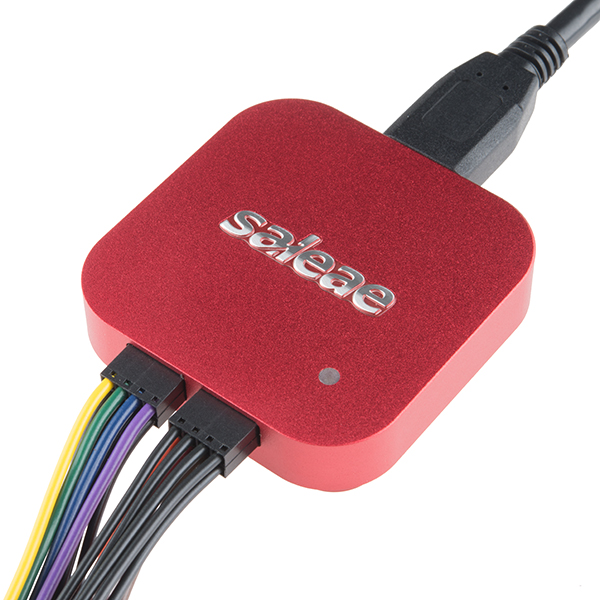
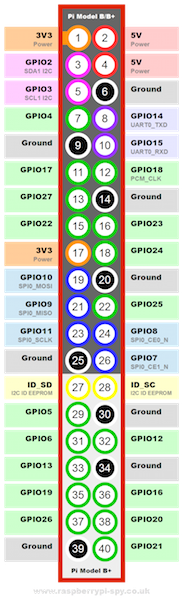

*Lab written by Philip Levis, updated by Pat Hanrahan*

### Learning goals
During this lab you will:

1. Install jumpers in the mini-din connector of the PS/2 keyboard.
1. Inspect the PS/2 protocol using a logic analyzer.
1. Test the keyboard to make sure it works with the Raspberry Pi.
1. Experiment with streamlining code to optimize its runtime performance.

In Assignment 6, you will complete your console application
by connecting a keyboard to the screen.
This will allow you to type commands
and display the results.
The goal of the lab is to setup PS/2 keyboard so that
you can immediately start on the assignment.

To complete the lab, you must complete the [check list](checklist.md).

### Lab exercises

To start this lab, pull from `cs107e.github.io` and go into
the directory `labs/lab6`. 

#### 1 Prepare your PS/2 cable and plug the keyboard into the GPIO header

Most modern keyboards are USB keyboards.
Unfortunately, the USB protocol is much more complicated than the PS2 protocol, 
and it is a significant amount of work to interface
a USB keyboard to the Raspberry Pi.
Instead, we will interface with a PS/2 keyboard which uses a 
simple serial protocol that is easy to decode.
The PS/2 keyboard appeared on the original IBM PC.

There are two common PS/2 devices: a keyboard and a mouse.
PS/2 devices connect to a PC using a 6-pin mini-din connector.
By convention, the mouse uses a green connector
and the keyboard uses a purple connector.

Spend some time reading through [this article](http://www.computer-engineering.org/ps2protocol/) to get more details regarding the ps2 protocol. Pay special attention to the Communication section.

    1. How do you know that the keyboard is in an idle state? 

    2. What is the start bit? What is the parity bit?
    
    3. Describe the process of how data gets sent when a key is pressed.

Now inspect the inside of the connector, 
you will see that it contains a plastic tab 
(that forces you to plug it in with the correct polarity)
and 6 male pins.
Two pins are NC (not-connected),
and the other carry VCC, GND, DATA and CLK.
Note the positions of each of these pins.

We will connect the mini-din connector to the Raspberry Pi using
20cm female-female jumpers.
Use a red jumper for VCC, black for GND, yellow for DATA, and white for CLK.
Insert each jumper into the corresponding pin of the mini-din connector.
It takes a bit of fiddling to jam all four of the jumpers inside the connector.
If you are having trouble, use a needlenose pliers.

We use female-female jumpers so that you can plug the other
end of each jumper directly into the GPIO header on the Raspberry Pi.
The keyboard receives power from the Raspberry Pi.
Connect the red jumper cable to a 5V source on the Pi,
and the black jumper cable to GND.
We suggest you use pin 4 for 5V, 
and pin 14 for GND.

#### 2 Use the Saleae Logic Analyzer to visualize the PS/2 protocol

We will use the Saleae Logic Analyzer to examine the signals 
being sent by the keyboard.

First, familiarize yourself with the logic analyzer.
It is contained in a small, red anodized aluminum enclosure.
On one side is a USB port, and on the other side are the jumpers. 
This logic analyzer can simultaneously watch up to 8 channels.
Each channel has a pair of jumpers (one for signal, the other for
ground) so there are a total of 16 jumpers. 
In this lab, we be watching the two channels DATA and CLK from the keyboard.

Second, connect the logic analyzer to the keyboard.
Connect the CLK line from the mini-din to channel 0
and the DATA line to channel 1. On the Saleae, the signal wire
for channel 0 is colored black, channel 1 is brown. The corresponding
ground line for a channel is directly underneath its signal wire.
You need to ground each channel to the Raspberry Pi to complete the circuit.
Connect the Saleae USB cable to the USB port of your computer.

Third, download and install the `Logic` application 
from the Saleae web site.
This application runs on Windows, Linux and Mac OS.

[Saleae Download](https://www.saleae.com/downloads)

You may also want to download the 
[user manual](http://downloads.saleae.com/Saleae+Users+Guide.pdf).

Launch the application; you should see a screen similar
to the following.

Fourth, configure the logic analyzer to acquire the signal.

Click the up/down arrow button to the right of the green "Start" 
button to access the setup options. Use a sampling rate of at least 1 MS (megasample)
per second and instruct it to record several seconds of samples.
You may also want to set the trigger so that 
the logic analyzer starts recording when the
CLK signal (channel 0) is falling. Configure a trigger for a channel by 
clicking the button labeled with "+ wave". 

Once you have the logic analyzer configured,
push *Start* and start typing on the keyboard. 
The logic analyzer should pop up a dialog saying that
it is capturing data.
After a few seconds it should return and display
the data it collected.
You can zoom in and out and pan left and right to see the
details of the captured signal. 
You should see the characteristic pattern of the PS/2 protocol.

The Logic application supplies common analyzers that
can be applied to the captured data. Click the "+" button next to "Analyzers",
choose "Show more analyzers", and then select "PS/2 Keyboard/Mouse" from the list.
Setup the analyzer so that the CLK is channel 0
and the DATA is channel 1.
The captured data is now decoded according to the PS/2 protocol
and it will display the hex values sent by the keyboard.

    1. What frequency is the PS/2 clock running at?

    2. What is the *make* code for the key `A`?

#### 3 Test the Keyboard and the Pi

Next, disconnect the keyboard from the logic analyzer
and connect it to the Raspberry Pi.
Connect the white jumper (CLK) to GPIO23 which is brought
out on pin 16,
and the yellow jumper (DATA) to GPIO24 on pin 18.

As a reminder, here are the pin outs on the GPIO header.

And here is what it should look like if everything is connected
up properly.

At this point, you should have a keyboard connected to the Raspberry Pi.
Let's test it using the program showed in class.

    % cd code/keyboard
    % make
    % make install
    % screen /dev/tty.SLAB_USBtoUART 115200

Push different keys and you should see the scan codes printed
on your screen.

From lecture, you will recall that scan codes are not ASCII characters. 

When you press a key, the PS2 keyboard sends a scan code. When you release that key, it sends another scan code. This scan code is the same as the first one, except it is one byte longer: it has a leading 0xF0. So pressing `z` will cause the keyboard to send scan code 0x1A. Releasing `z` will cause the keyboard to send scan code 0xF0 0x1A. If you hold down `z` long enough, the keyboard will send multiple press scan codes (auto-repeat). For example, if you press `z`, hold it until it repeats, then release it and press/release `g`, the scan codes received will be 0x1A, 0x1A, 0xF0 0x1A, 0x34 and 0xF0 0x34.

Try slowly typing single letters to observe the scan codes sent for press, release, and auto-repeat. Then try typing some special keys like shift.

    What is the sequence of codes for 'A'? 
    
    What does this tell you about how the code for shift is handled?
    
#### 4 Optimization

Change directory to `code/speed` and review the source in the main.c file. 
The program implements `strcpy`, the function to copy a 
string from the standard C library, along with some timer scaffolding
to count the ticks during the function's execution. The given version works
correctly, but is naive to a fault. Build the code as given, install it to the Pi,
and run it to get a baseline tick count. It is possible to gain more than a 1000x
speedup over the starter version!

Take a stepwise approch so you can measure the 
effect of a given modification in isolation.
Copy the starter function into a new version and make a single change.
Make a rough prediction about the expected gain from that change. Now
run and time the new version to see whether your intuition matches
the observed reality. Where the results surprise you, examine 
the generated assembly to see if you can figure out why there is
a different effect than you expected. Repeat this process, each time
advancing from the best version so far and making another small change.

Below are some suggested avenues to explore:

+ As the first improvement, that call to `strlen` inside the loop has gotta go! Hoist it out to earn a shockingly large gain. It's not the function call overhead that is so high (i.e. inlining `strlen` would not help much if at all), this is actually a big-Oh problem: recalculating the string length each iteration makes the copy function run in quadratic time instead of linear-- ouch! Most optimzation focuses on reducing the constant factors for an algorithm with a given big-Oh, but if you can restructure into a better big-Oh, that is generally a much bigger win.
+ Edit the Makefile to enable various levels of compiler optimization and rebuild and re-run. What difference do you observe between -O0, -Og, -O2 and -Ofast? Pick the best setting and let's see how much you can add to what gcc can do.
+ The two string traversals (once to get length, again to copy) can be unified into one traversal that stops after copying the null char. What improvement would you expect from this change? Try it out and see what difference it makes.
+ Will replacing array subscripts with pointer arithmetic help, e.g. `src[i]` into `*(src + i)`? What about walking a pointer down the string rather than accessing each char relative to start?  Try these changes out. What gain do you see?
+ Copying chunk of more than one byte has to be a win, right? Rewrite the loop to copy in chunks of size word rather than a single byte. The chunking gets a little tricky as string length might not be multiple of the chunk size, creating leftover to process at end. More critically, when iterating by word, the loop still has to examine each byte in the current word to check for presence of a null terminator, even though the whole goal was to avoid single-bytes and consolidate into chunks! Read [this page](http://bits.stephan-brumme.com/null.html) to learn of a clever way to efficiently find a null byte within a word. Talk to your lab partner to understand how the bitwise approach works.  Now try out the code and see how it fares.  (Note: last iteration by word might  read beyond proper end of string's memory -- is this read guaranteed to be safe? always dangerous? Why or why not?)
+ Try hand-unrolling the loop two or four times to better amortize loop overhead.  What gain do you see?

How big an improvement were you able to make overall?

## Check off with TA
At the end of the lab period, submit the checkoff form and ask your lab
TA to approve your submission so you are properly credited for your work.

