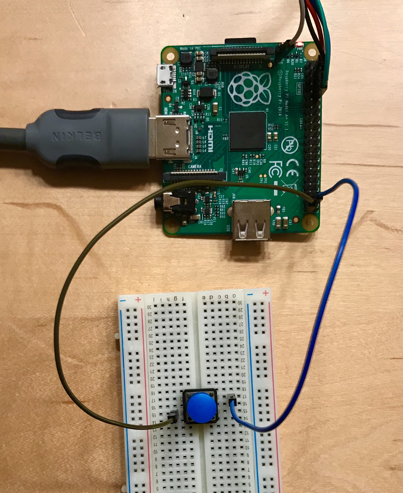


Task list to copy/paste when creating PR for this lab:

__Before releasing lab7:__
- [ ] Review writeup/code/checkin questions (instructor)
- [ ] Walk through (SL)
- [ ] Followup on issues from previous quarter postmortem (issue #)

__To prep for lab7:__
- [ ] Ensure monitor/cable per pair avail in lab



*Lab written by Philip Levis, Pat Hanrahan and Julie Zelenski*

## Goals

The goal of this lab is to get you started with interrupts in preparation for
your final assignment.

During this lab you will:

- Review the support code for interrupts on the Pi,
- Write code to handle button presses using GPIO event interrupts, and
- Brainstorm possibilities for achieving world domination with your final project.

## Prelab preparation
To prepare for lab, do the following:

- Change to directory `$CS107E/src` and go back over the code we reviewed in lecture: `interrupts_asm.s`, `interrupts.c` and `gpio_interrupts.c`
- Browse our [project gallery](/project_gallery/) to gather ideas and inspiration from the projects of our past students.

## Lab exercises

### Pull lab starter code

Before starting each new lab, first do a `git pull` in your $CS107E repository to ensure the courseware files are up to date.

```console
$ cd $CS107E
$ git pull
```

Now cd to your local `mycode` repo and pull in the lab starter code:

```console
$ cd ~/cs107e_home/mycode
$ git checkout dev
$ git pull --allow-unrelated-histories starter-code lab7-starter
```
### Interrupts

#### 1) Review interrupt assembly

In the first lecture on interrupts, we went over the low-level mechanisms. The `interrupts` module is used to configure interrupts and manage interrupt handlers at a global level. The module interface is documented in [interrupts.h](/header#interrupts) and its implementation is split into the files [interrupts.c](/src#interrupts) (C code) and [interrupts_asm.s](/src#interrupts_asm) (assembly). These source files are available in the directory `$CS107E/src`.

Start by reviewing the `interrupts_asm.s` file. The functions `interrupts_global_disable` and `interrupts_global_enable`
do as they indicate: they flip the interrupt bit in the CPSR
(current processor state register). The CPSR register is so important and
special that it has its own instructions to read and write it, `msr` and
`mrs`.

Next, the file defines `_RPI_INTERRUPT_VECTOR_BASE`, which specifies
the address where the interrupt vector table should go. On the Raspberry
Pi, this is address 0 -- one reason why null pointer errors are so dangerous!

`_vectors` is a table of assembly instructions, one entry for each of the
eight types of exceptional events. Each instruction is of the form 
`ldr pc, addr_of_fn` where `addr_of_fn`
is a data word that contains an absolute address. Loading that
address into the program counter will execute that function.
The idea is similar in spirit to a branch instruction, but rather than
being pc-relative, the target is expressed as an absolute address.

For us, almost all of the exceptions indicate a fatal error we can't recover from, so we simply want to exit.
We use `ldr pc, abort_addr` to load the absolute address `abort_addr` to execute `abort_asm`. This calls `pi_abort` which does not return.
Index 6 in the table is used for general interrupts; for this entry, we load `interrupt_addr` to execute `interrupt_asm`. This dispatches to the appropriate handler and then resumes the interrupted code.

The two data `.word` values named `interrupt_addr` and `abort_addr` hold the absolute address of the `interrupt_asm` and `abort_asm` functions.
These values are stored adjacent to the table of instructions. When installing the vectors, we copy from `_vectors` to `vectors_end` so as to include these entries. Look over the function `interrupts_init` of `interrupts.c` to see how the vectors are copied to the proper location.


+ What piece of state needs to change to globally enable/disable
interrupts?

+ To install the vector table, `interrupts_init` copies eight
instructions plus two additional words of data. What are those
additional words and why is it essential that they are copied along
with the table?

+ Note the many asserts in this code that try to defend against client misuse. Consider the private helper `vector_table_is_installed`. How does it confirm that the installed vectors are valid and uncorrupted? What kind of bugs does this check help to defend against? (hint: consider what location in the address space the vector table is copied to)


Let's now dig into the routine `interrupt_asm`. This is the critical assembly sequence to safely transition in and out of interrupt mode.  We reproduce the instructions below (but with no helpful comments):

```
interrupt_asm:
    mov   sp, #0x8000
    sub   lr, lr, #4
    push  {r0-r12, lr}
    mov   r0, lr
    bl    interrupt_dispatch
    ldm   sp!, {r0-r12, pc}^
```    

Carefully trace the sequence with your table mates and challenge one other to understand what each instruction is doing and why. Add your own annotation to each line to explain how it operates. Use the questions below to confirm your understanding. Ask for clarification on anything you find confusing.

+ Of the ARM's 16 general purpose registers, which are shared by 
interrupt mode and supervisor mode and which registers have a private copy per mode?

+ The supervisor stack is located at `0x8000000` and configured as one
of the first instructions executed in `_start`. Where is the interrupt
stack located and when it is configured?  A different approach would
be to configure the interrupt stack once at program start along with the
supervisor stack. Sketch the assembly instructions that could be added to
`_start` to do this. (Note: it will require temporarily going into interrupt mode)
If `_start` configures the interrupt stack in this way, would it then be safe/correct to then remove the first instruction of `interrupt_asm`? 

+ Where did `lr` gets its value from and why subtract 4 from it?

+ The C function `interrupt_dispatch` is called with one argument. What does that argument represent?

+ Unpacking all that happens in the final instruction of `interrupt_asm` is a real doozy.
The overt action is the `ldm` that loads the named registers with the values 
earlier stored onto the stack. The `sp!` means "writeback" (`sp` adjusted upwards for each
value loaded, i.e. popped from the stack). The `pc` is loaded with saved `lr` so that next instruction
to be executed will resume the interrupted code. And finally the `^` suffix 
copies `SPSR` into `CPSR`, which restores the previous processor state and mode. 
This special combination of `ldm` and `^` is specific to returning from an exception handler ([see ARM reference manual](https://developer.arm.com/documentation/dui0040/d/Handling-Processor-Exceptions/Entering-and-leaving-an-exception/Returning-from-an-exception-handler?lang=en)).

You're ready for this check-in question[^1].


#### 2) Review interrupt dispatch

In our second lecture on interrupts, we reviewed the process for dispatching a given event to its handler action. The design for both the dispatch modules `interrupts` and `gpio_interrupts` uses an array of function pointers, one per each kind of event. The client implements a function to process a specific event and registers the function as the event's handler. The dispatch module stores the client's function pointer in the array. When an event occurs, the dispatch invokes its associated handler. In the top-level `interrupts` module, the interrupt source number is the index into the array of handlers. In the `gpio_interrupts` module, the GPIO pin number is used as the index. 

There is a neat performance trick that both dispatch modules benefit from. To identify which type of event is pending, the dispatcher has to scan the bits in the pending register to find the first bit that is set. This bit scan is performed by the function `unsigned int count_leading_zeroes(unsigned int value)` declared in [bits.h](/header#bits). 

If you were implementing this function in C, a naive loop could test each bit. A more streamlined version could do fancy bit twiddling, such as Kernighan's algorithm, or rely on a lookup table. These versions might take anywhere from 8-100 cycles.

A better way to implement it is in assembly. ARM has a
[`clz` instruction](https://developer.arm.com/documentation/dui0473/m/arm-and-thumb-instructions/clz?lang=en)
that can do the scan in a single instruction. Review [bits_asm.s](/src#bits_asm) to see how it is used here.  This use of assembly cuts the time it takes to find a pending interrupt from 100 to 3 cycles, a 33x improvement. Given this code runs on every interrupt, this is an excellent performance improvement: it's why instructions like `clz` exist. Neat!

+ How is a function "registered" as a handler with a dispatcher? How does the dispatcher know which handler to call for a given event? Can there be multiple handlers registered for the same event? 

+ An `aux_data` pointer can be stored with the handler. That pointer is later passed to as an argument to the handler when invoked. What is the purpose of an `aux_data` pointer?

+ Review the implementation of `get_next_pin()` in [gpio_interrupts.c](/src#gpio_interrupts) to answer the following question. If there are pending events for GPIO pins 15, 30, and 45, which of these pins will be the next one handled?

Confirm your understanding of interrupt dispatch with this check-in question[^2].

#### 3) Set up a button circuit

Now let's get going on using interrupts in a program. Set up a one-button circuit on your breadboard. Connect one side of the button to GPIO pin 20 and the other side to ground. Connect your Pi to a HDMI monitor.

{: .zoom -w-50}

The button circuit is configured for a default state of high (1) by activating the Pi's internal pull-up resistor on the button GPIO.  When the button is not pressed, the resistor "pulls up" the value to 1.  When the button is pressed, it closes the circuit and connects the pin to ground. The value then reads as 0.

The `main` function in `lab7/button/button.c` sits in a loop, waiting for a button press and then redrawing the screen. Fill in the implementation of the empty `wait_for_click` function to operate by _polling_. It should:

1. Wait for a falling edge on the button gpio, i.e. watch for the pin level to transition from 1 to 0 ( using `gpio_read` to read the level).

2. Increment the `gCount` global variable and announce the event with a `printf("Click!")`

Compile and run the program. When you click the button, the message is printed and the screen redraws to show the incremented count of clicks. This version of the program is always redrawing or waiting for a click, but it's either one or the other. While waiting for a button press, the screen redraw is paused. While redrawing the screen, no button presses are detected. Ideally, we want the program to do both tasks concurrently.

- If you click the button multiple times in quick succession, some of
the presses are missed. You get neither a printed message nor a screen
redraw and these clicks are not included in the count. Why does that happen? 

You'll note that redrawing the screen is quite slow. If we speed
that up, it would cause us to miss fewer events, but we still have to spin waiting for a press and still can miss events. Interrupts will solve this problem.

#### 4) Write a button handler

Remove the call to `wait_for_click` from the loop in `main`. Compile and re-run. The program now repeatedly redraws the screen.  If you click the button, nothing happens, as the program is not reading the state of the GPIO pin, it's 100% occupied with drawing. 

You are now going to rework the program to intercept those button clicks as interrupts.

Start by reviewing the documentation for the library modules you will use:
+ [gpio_extra.h](/header#gpio_extra)
    * Gpio-specific events
+ [gpio_interrupts.h](header#gpio_interrupts)
    * Gpio interrupts module
+ [interrupts.h](/header#interrupts)
    * Top-level interrupts module
    
Remember there are __three__ layers to configuring and enabling interrupts:
1. Configure/enable specific event (in this case, gpio event)
    + Enable detection of desired event (falling edge for button gpio)
    + Implement handler function to process specific event
        * Handler must match prototype `void handle_click(unsigned int pc, void *aux_data)`. 
        + Use the `aux_data` parameter to pass a message to your handler. The handler should cast the received pointer to  `char *` to and use `printf` to output the message.
        + Be sure that your handler clears the event!
2. Configure/enable interrupt source (in this case, gpio interrupts) 
    + Init gpio interrupts module 
    + Register handler with gpio interrupts. For `aux_data`, use the string "YOUR-NAME-HERE has interrupt mojo" so the handler will print this message. 
    + Enable gpio interrupts
3. Configure/enable at top-level
    + Init interrupts module (at start of program)
    + Enable global interrupts (when entire system ready)

The order that you do these operations can be very important: think
carefully about each action, revisiting the lecture slides/code if
you need to.  Talk this over with your tablemates and ensure that you
understand what each step does and why it's necessary. 

Compile and run the program. If you have done everything correctly, the program continuously redraws as before, but now whenever you click the button, it prints a message to congratulate your prowess with interrupts and the click count increments.  You get the best of both worlds: your long-running computation can be written as a simple loop, yet the system is immediately responsive to input.

Once you have it working, go back and intentionally make various errors, such as doing steps out of order, forgetting a step, or doing a step twice.  Seeing the observed consequences of these mistakes now may help you to identify them in the future. You're ready for another check-in question[^3].

#### 5) Coordinate between main and interrupt

You want to change the program to now redraw once in response to a button click rather than continuously update. This requires that the interrupt and main code share state.

Edit the code within the loop in `main` to only call `redraw` if the count of clicks `gCount` has changed since the last redraw. Save the count used at last redraw and compare that saved value to `gCount` to determine when a redraw is necessary.

The count is being stored in the global variable `gCount`. The handler increments it and the `main` reads the value and compares to saved count.  `gCount` is not currently declared `volatile`. Should it be? Why or why not?  Can the compiler tell, by looking at only this file, how control flows between main and the interrupt handler? Will the compiler generate different code if `volatile` than without it? Will the program behave differently? Test it both ways and you'll be ready to answer this check-in question[^4].


#### 6) Use a ring buffer queue

Watch carefully as the program executes and you'll note that every click is detected and counted, but the count of redraw iterations is not one-to-one with those updates. Multiple clicks can occur before the `main` loop gets around to next checking the value of `gCount`.

To track all updates and process each one by one, we can use a queue to communicate between the interrupt handler and `main`. The handler will enqueue each update to the queue and `main` will dequeue each update. Because the queue stores every individual update posted by the interrupt handler, we can be sure that we never miss one.

How to rework the code:

- Review the [ringbuffer.h](header#ringbuffer) header file and source file [ringbuffer.c](/src#ringbuffer) to see the provided ring buffer queue. This ADT maintains a queue of integer values implemented as a ring buffer.
- In the `main` function, declare a variable of type `rb_t *rb` and initialize with a call to `rb_new`.  Use the `rb` pointer as the `aux_data` pointer when registering the handler.
- Edit your handler to now cast the `aux_data` parameter to type `rb_t *`.  In the handler, enqueue the updated value of count to the ring buffer by calling `rb_enqueue`.
- Edit `main` to use `rb_dequeue` to retrieve each update from the queue. This replaces the previous code that compared `gCount` to the saved value to detect a change in click count.

Make the above changes and rebuild and run the program. It should now redraw the screen once for each button press in one-to-one correspondence, including patiently processing a backlog of redraws from a sequences of fast presses. 

When you're done, take a moment to verify your understanding:

- Why is the significance of the return value from `rb_dequeue`? Why is it essential to pay attention to that return value?
- With this change, is it now necessary for `gCount` to be declared `volatile`? Does the ring buffer need to be declared `volatile`?  Why or why not?

You're ready for the final check-in question[^5].

### Project brainstorm and team speed-dating

Visit our [project gallery](/project_gallery/) to see a sampling of projects
from our past students. We are __so so proud__ of the creations of our past
students -- impressive, inventive, and fun! You'll get started in earnest on
the project next week, but we set aside a little time in this week's lab for a
group discussion to preview the general guidelines and kindle your creativity
about possible directions you could take in your project. If you have questions
about the project arrangements or are curious about any of our past projects,
please ask us for more info, we love to talk about the neat work we've seen our
students do. If you have ideas already fomenting, share with the group to find
synergy and connect with possible teammates. Project teams are most typically
pairs, although occasionally we have allowed solo or trios by special request.


### Bonus speed exercise
In past quarters, we have used some of the time in lab7 for explorations in performance optimization. We don't think there will be time for it today, but we linked the [materials](speed) if you want to check it out for fun.

## Check in with TA

Before leaving the lab, check in with us and discuss any challenges to answering the questions in the lab. If you do not feel confident about your responses, please ask us about it too!

[^1]: Why is 4 subtracted from the `lr`?

[^2]: If there is no handler registered for a pending event, what does the dispatcher with the event?

[^3]: What happens if an interrupt handler does not clear the event before returning?

[^4]: What is the consequence of not declaring the `gCount` variable as `volatile`?

[^5]: Why might you want the handler to enqueue an update and return instead of doing the actual task (e.g. redraw) directly in the handler?
